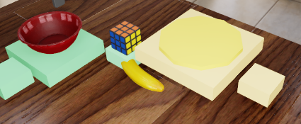
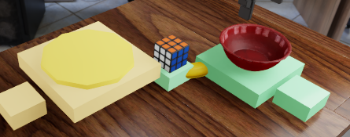

# SGW-01 bf independent native scene review

**Review complete; all four baselines need engineering repair before visual
setup acceptance.** The warmed renderer and recognizable cube/bowl inventory
pass this inspection. The main defect is unsupported, hovering support slabs.
DIST additionally has visible distractor/support interleaving that is not
covered by its current measured-object inventory. Neither finding is a model
failure or a six-trial physical-qualification result.

Reviewer: the single independent GPT-6 Astra session
`0f08c820-0979-467b-908f-fb307177a60d`, configured at maximum exposed reasoning.
Review date: 2026-09-23. This replaces only the optional human setup inspection.
It requires no routine human sign-off, grants no inference authority, and does
not replace later independent blinded prediction annotation.

## Evidence actually inspected

The native attempt is `sgw01-ali-prospective-capture-20260923bf`, with source
`fccf310c41fa16e8dc703491559c933558f08d96` and RoboLab
`0aef241fb088ca21bb4ebd24448940ed56620d17`.
The supplied archive is 125,607,789 bytes, SHA-256
`30e1837303d09d68e7e3dfbe642203a8da0b69472e47fc186a295381cf929570`.
Its export-manifest SHA-256 is
`25f860f0efc31a61a66a6448fd9dd5837a25dbd3dabb6f488c287145e0075ad5`.

I independently verified all 118 exported file byte counts and SHA-256 values,
the four capture and overlay-manifest canonical content digests, the exported
overlay/base-scene/base-workspace bindings, and all four repaired manifests
against the committed source-stage receipt at `7c1953c3`. I decoded all
484 video frames: 121 per capture. These are native render-warmup videos, not
behavioral rollouts.

I opened all twelve full-resolution final camera images, all 72 retained
lossless diagnostic samples through labeled contact sheets, and 24 decoded
video samples. Sample indices were fixed at 0, 1, 10, 30, 60 and 120, across
both shoulder cameras and the wrist camera. Final images are byte-equivalent
arrays to render frame 120. PNG previews preserve original RGB pixels; contact
sheets only resize images and add labels. Four explicitly bounded detail crops
were also inspected for support/distractor appearance.

Every snapshot records the same simulation time, `0.01666666753590107 s`.
The 30-FPS video timeline is display time only. No action, physical settling
sequence, successful landing, or stability trial occurred during these videos.

The export contains 22 recording files per capture: 18 sampled warmup arrays,
three final arrays and one full video. The other 115 warmup arrays per capture
remain outside this export. The producer/fresh-CPU reports attest 137 verified
recording files per capture; I do not misrepresent that remote verification as
my own byte-level verification of the absent arrays.

## Findings and requested engineering response

### F1. Unsupported elevated slabs: repair required, high confidence

The supports look like thin pads with no visible bases or mounting structures.
Cross-checking their measured AABBs against the measured table top at
`z = 0.05000072345137596 m` establishes the following gaps below the supports:

- Both HEIGHT scenes: reference support 42.4526 mm, neutral-cube support
  40.9047 mm, upper landing support 80.9047 mm. The lower landing support gap
  is only 0.9047 mm and is not the material defect.
- Both DIST scenes: plate support 23.9993 mm. The bowl support is 2.4526 mm
  above the table; the neutral and landing pads are 0.9047 mm above it.

The exact USDs contain translated 40-mm-thick boxes, not pedestals extending
down to the table. SGW-ENG-006 makes them fixed kinematic contact-reporting
bodies; that prevents falling but does not supply missing visible structure.
The HEIGHT bowl itself touches its reference slab geometrically, so this is
not a claim that the bowl is separated from that slab. It is the unsupported
slab carrying the reference, and the similarly suspended neutral/upper slabs,
that make the setup visually and physically misleading.

**Requested response:** give the elevated surfaces visible, collision-consistent
pedestal or mounting geometry while retaining their intended top surfaces,
scored-object centers and side labels wherever possible. Preserve bf evidence,
disclose the prospective engineering revision, and capture the revised baselines
in fresh roots before accepting them. This recommendation changes no scientific
threshold or sample count.

Image anchors: frame 120 in both shoulder cameras for all four captures;
the HEIGHT detail crop is from `0-height-left`,
`over_shoulder_right_camera`, source rectangle `[400,255,770,470]`.
Confidence: 9/10 for the engineering defect; the numerical gaps are reproduced
directly from the hash-bound capture records, not inferred from pixels.

### F2. DIST banana/support interleaving: unresolved collision risk

The inherited yellow banana is visible beside the cube pedestal. In DIST-left,
it visually runs into/under the neutral pedestal and the plate-support edge.
In DIST-right it is largely hidden between the cube pedestal and bowl support.
The paired arrangements therefore have different distractor occlusion.

The banana is absent from the current capture's measured `objects` and contact
inventory, despite being present in the image, base USD and dependency/material
inventory. Its earlier, hash-bound base-workspace AABB overlaps the proposed
DIST neutral pedestal in both variants. It also overlaps the left variant's
plate-support AABB and the right variant's bowl-support AABB. These are
**inherited-pose AABB risk checks, not measurements of current mesh penetration
or contact**. The current seven/nine-object AABB checks alone cannot establish
a collision-free scene containing this additional object.

**Requested response:** before freezing DIST candidates, either demonstrate
actual distractor/support clearance with current geometry/contact evidence or
make a documented, consistent distractor-placement correction and recapture.
Do not classify an overlapping AABB alone as physical collision or a model
failure.

Image anchors: final/render-120 `2-dist-left/over_shoulder_right_camera`
rectangle `[385,295,810,470]`, `2-dist-left/over_shoulder_left_camera`
rectangle `[605,260,825,430]`, and
`3-dist-right/over_shoulder_left_camera` rectangle `[500,280,945,455]`.
Confidence: 9/10 for visible interleaving and the missing current banana
measurements; actual collision remains uncertain.

### F3. Plate identity and view limitations: distinguishable anchor, uncertain category

Both DIST shoulder views show a red concave bowl and a separate pale-yellow
flat polygonal disc. They are visually distinct anchors. The disc has no
visible rim, texture or dish curvature and is close in color to its rectangular
support. Its identity as a conventional plate, rather than a puck/pad, is
less clear than the bowl's identity. I do not mark the plate absent, nor claim
that a policy has or has not recognized it.

Consider improving plate/support contrast or plate-like surface cues during
the existing engineering repair. If the simplified disc is retained, record
the category ambiguity and check the actual policy-sized inputs. That is a
setup caveat, not evidence of language failure and not a substitute for the
prespecified semantic-label validation.

The wrist view does not independently expose the whole DIST relation: the
cube is partly masked by the gripper and the plate is mostly cropped or
occluded at the lower edge in both variants. In HEIGHT the wrist view shows
the cube clearly but partly masks the bowl and most landing areas. The two
shoulder views provide complementary inventory coverage. These limitations
must remain visible in later prediction-coverage/unknown labels; they do not
justify moving a camera, changing a prompt, or forcing a 3D semantic label.

One DIST landing pad is hidden by the plate assembly in the left shoulder
view of DIST-left and in the right shoulder view of DIST-right; the opposite
shoulder view exposes it. The near/far goals are not established by those
2D appearances.

Confidence: 9/10 for the camera occlusions and distinct bowl/disc inventory;
7/10 for the plate-category concern.

### F4. Warmed appearance: pass, with the original warmup retained

At diagnostic frame 0 the table is dark and bowl/cube materials are wholly
or partly unready. Samples 1, 10, 30, 60 and 120 show the wood table,
multicolored gridded cube, red bowl and yellow banana consistently. No
remaining gray/missing-texture defect is apparent at frame 120. Added supports
and the DIST disc use simple flat colors rather than failed object textures.
All six material references report resolved files in each receipt.

The recorded 120-update render-only warmup remains necessary. This review
does not authorize shortening it based on the early sample that first looks
ready. Confidence: 9/10.

## Per-scene visual disposition

1. **HEIGHT, upper support left (`0-height-left`): FAIL setup acceptance,
   repair F1.** Cube, red bowl, inherited banana and four colored supports
   are recognizable. Both shoulder views show the inventory; the wrist
   masks part of the bowl/landing areas. No obvious penetration among the
   recorded task objects is established. The upper/reference/neutral slabs
   hover above the table. Confidence: high.

2. **HEIGHT, upper support right (`1-height-right`): FAIL setup acceptance,
   repair F1.** The same material/inventory assessment holds. The upper and
   lower landing locations correctly swap lateral sides, with corresponding
   view-dependent gripper/bowl occlusion. The unsupported-slab defect remains.
   Confidence: high.

3. **DIST, bowl left (`2-dist-left`): FAIL setup acceptance, repair F1;
   resolve F2.** Cube, red bowl and a separate yellow disc are visible in
   both shoulder views. Plate-category recognition remains uncertain.
   The left shoulder hides the far plate-side landing pad, while the right
   exposes it. Wrist-only relation evidence is unavailable. Confidence:
   high for support/visibility observations, uncertain for actual collision.

4. **DIST, bowl right (`3-dist-right`): FAIL setup acceptance, repair F1;
   resolve F2.** Bowl/plate sides swap correctly, and both anchors remain
   visible in the shoulder views. The fixed banana becomes more obscured by
   the bowl/cube-support arrangement. The right shoulder hides the far
   plate-side landing pad; the left exposes it. Wrist-only relation evidence
   is unavailable. Confidence: high for support/visibility observations,
   uncertain for actual collision.

These are independent setup-review dispositions, not formal physical
candidate rejection receipts. No candidate has been frozen or consumed by
this review.

## Measured checks, kept separate from the visual verdict

- **Transforms:** captured actor roots plus WXYZ-rotated root-local offsets
  reproduce all recorded geometric centers, with maximum coordinate residual
  below `4e-18 m`. This is algebraic consistency, not independent metrology.
  The cube's approximately `[-0.010160, 0.028929, -0.002404] m` local offset
  matters; its actor origin must not replace its geometric center.
  Quaternion norms are consistent with one to floating-point precision.
  All four environment origins are zero.
- **HEIGHT neutrality:** cube and bowl geometric-center heights both equal
  `0.1599999964237213 m`; the recorded starting signed relation is exactly
  zero in both variants, within the frozen 5-mm band.
  Same-orientation geometric extrapolation from the measured landing tops
  would put the cube near `z=0.12 m` or `z=0.20 m`, around the reference at
  `z=0.16 m`, giving approximately -40/+40 mm. These are **hypothetical**
  center landings, not observed releases or reachability measurements.
- **DIST neutrality:** cube center is approximately `[0.55,0,0.12] m`, with
  bowl `[0.44,+/-0.16,0.12] m` and plate `[0.66,-/+0.16,0.12] m`.
  The full 3D distance difference is zero in each captured variant.
  Same-orientation geometric landing extrapolations yield approximately
  +341.664 mm near the bowl and -366.260 mm near the plate. Again, these
  exceed 30 mm only as geometric calculations, not as scored physical trials.
- **Counterbalance:** HEIGHT upper-support y changes from +0.23 to -0.23 m;
  the lower support swaps oppositely. DIST bowl y changes +0.16 to -0.16 m,
  with plate/associated supports mirrored accordingly. Cube and table roots
  and all recorded orientations are retained. The inherited banana and
  cameras are not reflected; this is not a full-scene mirror. Two baselines
  per family do not establish the future 12/12 confirmation allocation.
- **Initial cube contact:** the cube/neutral-support filtered-force magnitude
  is `1.9833185804 N` for each HEIGHT scene and `1.9833457606 N` for each DIST
  scene. Every recorded cube/goal-support force is zero, as expected before
  transport. These zeros are observed initial contacts, not missing values,
  failed landings or model outcomes.
- **Support geometry:** cube AABB bottom meets neutral-support top in all
  four records. Bowl bottom meets its support top geometrically; DIST plate
  bottom meets its own support top to numerical precision. No positive-volume
  AABB overlap beyond a 1-micrometer numerical screening tolerance was found
  among the explicitly recorded task objects. This
  excludes neither hidden mesh problems nor interference with the omitted
  banana/robot, and says nothing about grasp/transport paths.

## Still unavailable; no pass implied

Current banana poses/AABBs/contacts; numerical camera calibration and exact
post-packing policy views; bowl-support and plate-support contact-force
records; a measured gripper/cube-detachment stream; final scoring-center
acceptance; new-scene controller/Abs-IK landing calibration; three independent
resets per goal; pickup, both released landings, anchor stability and the final
0.5-second velocity window under the 450-action cap. Six scripted physical
trials per candidate, historical-layout deduplication, the 29-layout family
gate, native model/runtime gates and later blinded prediction annotation all
remain separate.

Six inherited USD payloads per receipt and the MDL/texture payload bytes were
not exported here. Their source paths/hash or resolution records are retained
in the captures, but were not rehashed locally by this reviewer. The exported
base scene, overlay and workspace bytes were rehashed. The original aq
manifests were also not exported; unchanged design values under SGW-ENG-006
are attested by the committed stage-be comparison, not independently
recomputed against the absent aq bytes in this review.

## Exact evidence identities

SHA-256 below denotes **file bytes**, unless explicitly called a content digest.
Complete final-camera source hashes and preview hashes are in
[`media_index.json`](media_index.json); full measured rows, all source-layer
records and per-scene numerical derivations are in
[`geometry_and_integrity.json`](geometry_and_integrity.json).

**HEIGHT left**

- Capture: `20c16465cb215e5458b14e8ec68957eae17b6c609bb0d442af38205e940e9f30`
- Manifest: `c770afb0c2105b0b4ab2ac4064dce0516848e0af97a69f15324f2bd4a460c4c6`
- Overlay: `847a7fd074131b1b86cac3c7dae30a77a79ac03b40cee526e8c58db9cd713de1`
- Video: `a16be885e1e54021770c55d505ae75206501d911a8f1938b2286213d4c8e71f6`

**HEIGHT right**

- Capture: `56c92caa5d7b79de915c237e0dddb15ee5d5e84b4cde13dbc9946a2c2a026b71`
- Manifest: `ac915b53de429117a6c72ea5cbcd63d934019e6bc0250eda9bc6a09ad2decef2`
- Overlay: `5700f244702932c43caff42f210d4c85288f5037cd125957d726df443abbca09`
- Video: `da0b515e3af1f9925cfdaa557b1267c4d346f9a4f0eab4fe0d88ba62dd77f0eb`

**DIST left**

- Capture: `e5e149208b93e33400e7db47f52c8711f688c7cf32cbeb201b1fdeffae7745fd`
- Manifest: `48c4c7cef9e70bf81bc4ea05ebc5de24fd2e2c50d18c1a91bab2517de0fcdf19`
- Overlay: `c03dbd34cb88d4a80ed98299ebdaeb6f0c617b3e00f47c69823501933ea9f610`
- Video: `9d16a41443184eac37fde3ea93e699a308be0f52f8794cc4907d4a681c4b7d2d`

**DIST right**

- Capture: `d7566dd505996d0c658a7f0e0514bf1f55a8d71be1e7f5db1ec0bb1eac0821c9`
- Manifest: `2f1202af695a54eb2c2e6405dfe38c36b0a23dc6554c9e14e34a76fd98e2965d`
- Overlay: `0127a6f2eb4593d5b68ead6bd66b112279c395453c664073eae83b8f4641e1ec`
- Video: `f440ae46496466cdf5aa79a7d49737f90af99793269b690c4396e2a194cf0d97`

**Shared source and derivation identities**

- Base USD: `22b95d601defb9252a448a1b37d0548e1f2dc3bfb0c3d86a04c2ef5c4cc817a0`
- Base workspace file: `1ef79d38f5004c40b2c5161a8c42aca2298dcbbf60d67ff3e48a19642c567e0e`
- Asset-manifest binding: `3a9b8ceeff333aa3a060dad97707b5f2a50e7c4db1423c84350bf4d8a19b0806`
- Locally matched renderer receipt: `e482ca8893ff7b8dd8d20d2183602dfd9647fd7fee9cdf2451ab4dc654d0a9c5`
- `prospective_family_capture.py` at source fccf310c:
  `d082233a6723dcce644c6a3f5f826d17d6ad207215873242e7e4646baa1eb7c5`
- `prospective_family_scene.py` at source fccf310c:
  `df8cb07a004f1904fa36c79cb54bdb9da1f06ae8fcdafa6c720aa028270de9cc`
- `prospective_family_capture_task.py` at source fccf310c:
  `8c0965c71a5bdedbb21beb9289057231b38dd6ab5c1a8dfc3d19fb6db827706d`
- `lat_workspace_capture.py` at source fccf310c:
  `c3e1b3d2a5131331e4891823bb74464cc85f27500fb46a287b8f08c82986e919`
- `geometry_and_integrity.json`:
  `7fa9e0038ba4f4aaae66b01e8f86ebf5596cef0519ad9295d29efc60fe8e7e9f`
- `media_index.json`:
  `6862b2d61c0512927172a9a2d3c08ff011aa591db4f501362efeb703fa064e27`
- Reviewer reproducer `../prepare_sgw_scene_review.py`:
  `d590f61c454769ea92dcc4cec9e95e345352691006f3c204adf5cc8d5920623f`

Original PVC mapping is preserved in the export manifest. Capture raw roots
are under `/data/users/ali/sgw-01/qualification/prospective-families-20260923bf/`;
the four scene suffixes above select the exact capture and `views/`/
`render_diagnostic/` files. Repaired design manifests and overlays are under
`/data/users/ali/sgw-01/infrastructure/source-stage-20260923be/prospective/`.

This reviewer made no cluster changes, loaded no policy or simulator, edited
no study protocol/status/release file, and created no scientific denominator.
