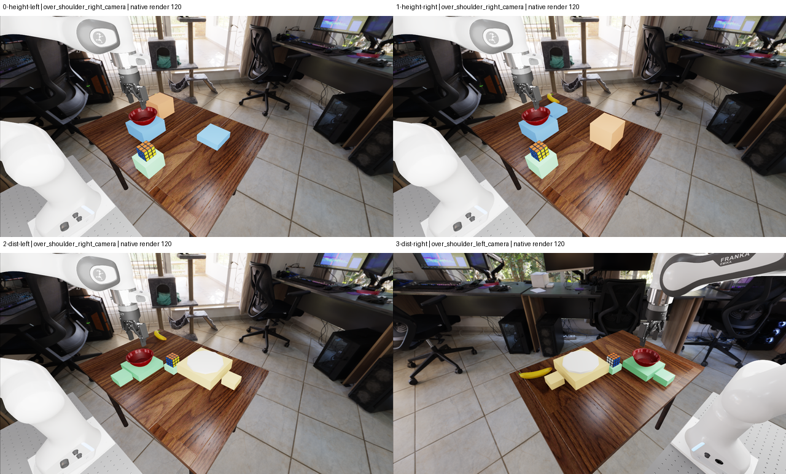

# SGW-01 bi independent native scene review

**All four bi captures are accepted for native visual setup only.** The new
evidence addresses bf findings F1 (hovering slabs) and F2 (banana/support
interference). F3 is only partly resolved: the off-white disc is now distinct
from its yellow support, but its plate-category identity remains uncertain.
All 20 source-replayed policy images have now also been inspected and
independently reproduced pixel-for-pixel on CPU; see the
[policy-image addendum](policy_input_review.md). This is not live model-input
qualification, and the category/occlusion caveats remain.

This is the same independent GPT-6 Astra reviewer's SGW-ENG-007 follow-up,
not a second independent rater or blinded prediction annotation. Reviewer
session: `0f08c820-0979-467b-908f-fb307177a60d`; model `gpt-6-astra`, maximum
exposed reasoning. Date: 2026-09-23. The bf report and its sealed manifest
remain unchanged. Routine engineering does not require human sign-off.

## Per-capture disposition

1. **HEIGHT, upper-support side left: ACCEPT native scene.**
   Capture SHA-256:
   `d8c961be41b65d4d6860f550466a2a0b000d44bd147f631901f6de31d98b9148`.
   Both shoulder views expose the cube, bowl and lower/upper supports.
   The reference, cube and upper supports are now table-connected blocks.
   The relocated banana is clear in the left shoulder view and hidden behind
   the upper block in the right shoulder view. The wrist still partly masks
   the bowl and most landing areas. Confidence: 9/10.

2. **HEIGHT, upper-support side right: ACCEPT native scene.**
   Capture SHA-256:
   `35327020323b406969eef7613d94946bd776001567d0dcc4e223dfc3330ad3b7`.
   The same grounded construction and recognizable cube/bowl inventory hold.
   The upper/lower locations correctly exchange robot-lateral sides.
   The right shoulder view partially overlaps bowl, lower support and banana
   in projection; that is not evidence of contact. Wrist limitations persist.
   Confidence: 9/10.

3. **DIST, bowl side left: ACCEPT native scene with F3 caveat.**
   Capture SHA-256:
   `beb0991e7f11bbd57f4e762627ceffd478aeeab1e91a6f4f65723e2c41d31b32`.
   Cube, red bowl and off-white disc are distinct in both shoulder views.
   The right shoulder separates both anchors and both small landing pads
   clearly; the left shoulder has a front/back alignment and hides the
   plate-side landing pad. The banana no longer interleaves with the central
   task objects. The wrist does not expose the full plate.
   Confidence: 9/10 for setup and visibility; plate category remains uncertain.

4. **DIST, bowl side right: ACCEPT native scene with F3 caveat.**
   Capture SHA-256:
   `7a8ace8867e0e1807518b9ca073c2004fc80fe9b9c11a1a489d57a49857ee19a`.
   The left shoulder separates both anchors and the landing pads clearly;
   the right shoulder hides the far plate-side landing pad. The banana is
   separated from the plate assembly, although partly hidden behind it in
   the right shoulder projection. Wrist plate/cube coverage remains limited.
   Confidence: 9/10 for setup and visibility; plate category remains uncertain.

**Acceptance is restricted to these exact native capture bytes.** It is not
fixture qualification, acceptance of any translated candidate, proof of
reachability or grasp/release, policy-category recognition, or behavioral
release. No additional native-only repair is requested from the observed
evidence. The completed offline policy-image inspection is a separate result;
all measured downstream gates remain independent.



## F1: grounded supports now supported by images and measurements

The native images show continuous block sides reaching the table rather than
the earlier thin hovering slabs. The exact overlay source uses pedestals
extending from the measured table top to the previous support top planes.
The support bodies remain fixed kinematic collision/contact bodies.

Measured table-top z is `0.05000072345137596 m`. Across all 18 support
instances, the largest absolute support-bottom/table-top residual is
`3.725290298461914e-9 m`, consistent with float precision rather than a
visible air gap. The largest measured support-top change from bf is
`7.450580596923828e-9 m`; all XY AABB footprints are identical.
Cube, bowl, plate where present, and table measured rows match bf exactly:
roots, WXYZ quaternions, geometric centers, root-local center offsets and
AABBs all have zero recorded coordinate delta.

The authoring comparison finds only support center-z/height changes and the
DIST plate color change among the existing primitive specifications.
No claim of unchanged physical dynamics follows from unchanged scored poses:
the collision volumes have intentionally changed and still need qualification.
Confidence: 9/10 that F1 is addressed for these captures.

## F2: current banana geometry and filtered contacts now available

Unlike bf, every bi receipt includes the banana as an actual measured actor.
Its recorded root and geometric center are
`[0.800000011920929, 0.38999998569488525, 0.06946864724159241] m`
in all four scenes, with its retained WXYZ orientation and zero recorded
root-local center offset. Its AABB is:

- minimum `[0.7453150153160095, 0.3006799817085266, 0.05000072345137596] m`;
- maximum `[0.8546850085258484, 0.4793199896812439, 0.08893656730651855] m`.

The banana bottom matches the table top exactly at recorded precision.
Its XY AABB is inside the measured table, with the nearest table-edge margin
42.7483 mm. Minimum Euclidean XY AABB separation from any added support is
25.3242 mm in each HEIGHT variant, 221.1991 mm in DIST-left, and 20.6800 mm
in DIST-right. Thus these measured resets satisfy the disclosed ENG-007
20-mm engineering clearance rule. The DIST-right headroom is only 0.6800 mm:
the existing measured clearance screen must remain active for each future
candidate/reset, rather than inheriting a baseline pass.

Native banana/table filtered force norms in capture order are
`2.3150529861`, `2.3146770000`, `2.3148262501`, and `2.3148484230 N`.
Every retained banana/added-support matrix is exactly zero. The additional
banana/plate matrix in each DIST capture is also zero. Sensor identifiers,
matrix dimensions, finite values and boolean force summaries were checked.
Zeros here are observed initial measurements, not unavailable contacts.

Together with the actual views, this resolves the prior unsupported
distractor-interference concern for the recorded initial states. The expanded
object inventory has no positive-volume AABB overlap beyond a 1-micrometer
numerical screening tolerance. It is not a whole-robot mesh-collision
certificate or a statement about later motion. Confidence: 9/10.

## F3: contrast improved; category and occlusion caveats retained

The dynamic plate primitive remains a radius-0.11-m, thickness-0.012-m
cylinder at its unchanged center and orientation. Only its display color
changes, from yellow to off-white `[0.94,0.94,0.90]`. The warmed views now
show a distinct light disc on a yellow square pedestal, separate from the
red concave bowl and the multicolored cube.

This is a clear inventory/contrast improvement. It does not add a visible rim,
concavity or other unmistakable dish feature: a flat puck/pad interpretation
remains plausible. Distinct-anchor visibility passes this native inspection;
conventional plate-category identification remains uncertain. Confidence:
9/10 for improved contrast and 7/10 for the category concern.

Both DIST wrist views still crop or obscure most of the disc, and partially
mask the cube with the gripper. HEIGHT wrist views show the cube clearly but
obscure part of the bowl and landing supports. A projected finger/bowl overlap
is not a measured collision. Shoulder views provide complementary coverage;
no claim is made that each individual camera identifies every object or goal.

**The exact source-replayed policy images are reviewed separately in the
[addendum](policy_input_review.md).** All 12 D1 API camera images and all
eight N3 server/spatial images were opened; their 20 PNGs and decoded RGB
arrays match an independent CPU replay exactly. Distinct-anchor contrast
survives the supplied preprocessing, but the plate remains a rimless disc and
the wrist-view limitations persist. This is not a model-recognition or
semantic-label pass. The thumbnails and crops in this native report are only
display diagnostics, not policy preprocessing. Pixel height is not world
height; image proximity is not 3D distance. Ambiguous later semantic evidence
must remain unknown.

## Other measured and rendering checks

Captured HEIGHT center-height difference and full 3D DIST distance difference
are exactly zero in both corresponding variants, within the frozen 5-mm
neutral band. The underlying geometric center definitions and WXYZ/root-local
offset reconstruction were checked rather than treating actor roots as centers.
HEIGHT's lower and upper landing planes still surround the intermediate
bowl-center height; DIST keeps opposite-side bowl/plate anchors. Counterbalance
labels and scored-object poses are unchanged. This remains a scored-object
position counterbalance, not a full-scene/camera mirror.

Same-orientation geometric landing extrapolations retain approximately
-40/+40 mm HEIGHT and +341.664/-366.260 mm DIST margins. They are not observed
landings, not controller calibrations and not proof of reachability.
Initial cube/neutral-support force norms are approximately 1.98330 N for
HEIGHT and 1.98335 N for DIST; initial cube/goal-support forces are zero.

All final cube, bowl, banana and table materials are ready and recognizable.
Render sample 0 still has unready dark object/table materials; samples
1, 10, 30, 60 and 120 show the textured scene consistently. The existing
120-render-update warmup is retained, not shortened by this observation.

Every warmup snapshot records simulation time `0.01666666753590107 s`,
with zero controller/physics actions during the diagnostic. The videos'
30-FPS/four-second display timeline is **not four seconds of physics**.
One initial contact-force sample and unchanged render-time poses do not
establish settling, sustained support, anchor stability or release.

## Coverage, provenance and reproducibility

Capture source: `5f7a0911b7384b98cc2094b4054ad75f9c3b226b`.
RoboLab: `0aef241fb088ca21bb4ebd24448940ed56620d17`.
Archive: 124,817,255 bytes, SHA-256
`0305c508b25cead38263399209269544526377c7a94c7c0c079baa7c2f3e286e`.
Export-manifest SHA-256:
`cf5797a7d6cf171bdffe1d6d3bf8ae4de1f9fcd46bb44bf736704a538709025c`.

The archive and all 118 exported file sizes/hashes were independently verified.
I checked capture/manifest canonical digests and the exported base/workspace/
overlay bindings, decoded all four 121-frame videos (484 frames total), and
actually opened all 12 full-resolution final views, 72 lossless warmup samples
through labeled sheets, and 24 decoded video samples. Diagnostic indices were
0, 1, 10, 30, 60 and 120; final images match each camera's render-120 array.
Four unrescaled native-pixel detail crops and the overview accompany the report.

Only 22 recording files per capture are exported locally: three final arrays,
18 sampled warmup arrays and one complete video. The other 115 recorded warmup
arrays per capture are not locally available. The parent's separate PVC
verification of all 137 files per capture is not represented as this
reviewer's own byte-level verification of the missing arrays. Inherited USD
payloads and MDL/texture payloads not included in the archive were likewise not
rehashed locally; their recorded identities/resolution status remain bound
through the native receipts.

Detailed measurements and the bf comparison are in
[`repair_checks.json`](repair_checks.json) and
[`geometry_and_integrity.json`](geometry_and_integrity.json).
Original camera/frame identifiers, source-array hashes and unaltered-pixel
preview bindings are in [`media_index.json`](media_index.json) and
[`repair_images.json`](repair_images.json). The companion sealed manifest
binds this report, those files, the reproducer, exact capture/scene/video
identities and the diagnostic images, together with the separate policy-image
addendum and its source/replay bindings.

From this session's `files/` directory, reproduce into a new output directory:

```bash
sgw-review-env/bin/python prepare_sgw_bi_scene_review.py \
  --evidence sgw-bi-review-evidence --output NEW_REVIEW_DIRECTORY
```

The reproducer requires the exact sibling `sgw-bf-review-evidence/` for the
before/after comparison and hash-checks the unchanged bf verifier before using
its offline integrity/media functions. No simulator/model code is imported.
Outputs are exclusive-create; existing evidence and prior reports are never
overwritten.

## Boundaries still in force

No measured Abs-IK/controller landing calibration, six scripted trials per
candidate, three-repeat reset qualification per goal, pickup/detached release,
anchor-motion check, final 0.5-second velocity window, historical deduplication
completion or family/model runtime release is established here. Numeric camera
calibration and complete bowl/plate/gripper contact histories are not included.
Each missing gate remains unavailable, not a success or a model failure.

This follow-up changes no frozen protocol, candidate count, sample allocation
or scientific threshold. It starts no policy request or behavioral episode,
creates no prediction labels, and is not the later two-annotator procedure.
No cluster, model or simulator operation was performed by this reviewer.
