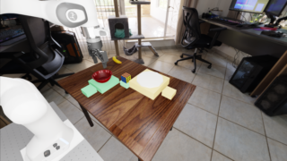
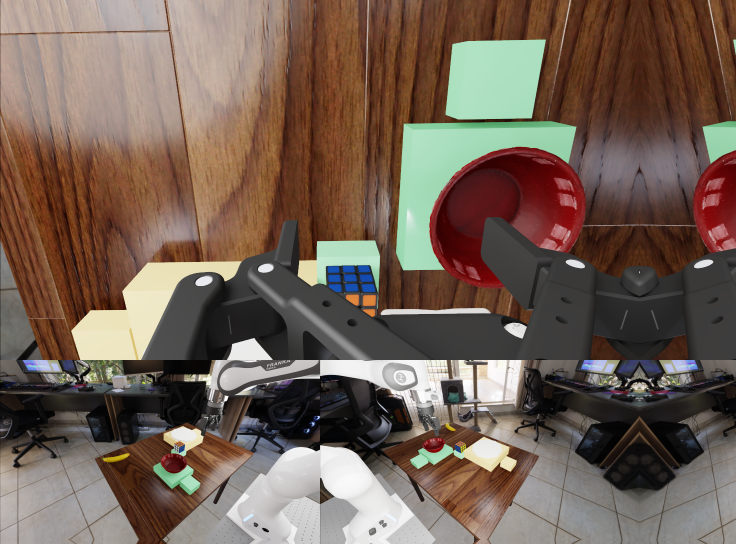

# SGW-01 bi policy-image review addendum

**All 20 supplied policy-preprocessing PNGs were opened and independently
reproduced with identical PNG bytes and decoded RGB pixels.** The four native
scene acceptances stand. Cube/bowl visibility and the improved off-white
disc/yellow-support contrast survive the reviewed stages. The disc's
plate-category identity remains uncertain, and wrist coverage remains
incomplete. No additional native-scene repair is requested from these images.
This is an offline image-stage inspection, not live runtime qualification,
internal model-tensor parity, semantic recognition, or behavioral release.



Same reviewer and date as the [native report](independent_scene_review.md):
GPT-6 Astra, maximum exposed reasoning, session
`0f08c820-0979-467b-908f-fb307177a60d`, 2026-09-23. This follow-up is not another
independent rater or the later blinded prediction-annotation procedure.

## Evidence and independent replay

The original supplied image manifest is
[`../sgw-bi-policy-inputs/manifest.json`](../sgw-bi-policy-inputs/manifest.json),
SHA-256
`065a192aef51b65870ed885d176292ef15b8e7198d8b17ac66ef77c217169b41`.
It binds all 20 PNG and decoded-RGB hashes, shapes, ranges, source camera NPY
records, source texts, configuration and reproducer. The source NPYs were
checked against the already-verified bi archive, not against a generic resize.
All four scenes have three D1 images and two N3 images; none is unavailable.

I ran the unchanged supplied reproducer, SHA-256
`00e5860563bbe2fb324f8f1a6a7b8c44ebe9de2a28e31ab923e20de6ccc9c7db`,
in a separate reviewer-only directory using Python 3.13, Torch 2.7.1,
TorchVision 0.22.1, NumPy 2.5.1 and Pillow 12.3.0. The selected audited image
functions ran on CPU; no policy model was instantiated, no checkpoint weights
were loaded, and no server, simulator or model request was started.
The initial Python 3.14 environment could not install the pinned Torch
version; a compatible isolated environment resolved this without changing
the producer's Torch/TorchVision/NumPy versions or source.

The independent replay manifest SHA-256 is
`4d2e735fcd84ff0e4f36386980a8e629645b2fe11a0185dbad48d642908d2bc2`.
All its metadata matches the supplied manifest except output paths.
[`policy_replay_verification.json`](policy_replay_verification.json),
SHA-256 `8dc0d781744f473ad693189382a73ea2513b6300baafc4cda66348a5ad5200ee`,
records **20/20 identical PNG hashes and 20/20 identical decoded-RGB hashes**,
plus a separate NumPy reflection-padding equality check for each N3 output.
[`policy_input_integrity.json`](policy_input_integrity.json) binds the original
source files, configuration audits, source arrays and copied image identities.

The supplied checkpoint configuration reconstructs to exactly 7,735 bytes
and its declared SHA-256
`11577909f49e95d62456b6a497cf7b883f8987a3186d720d838ea5de0e493366`.
It has no top-level `dataloader_train`; the inspected server selection logic
therefore uses the default action-transform path with
`keep_aspect_ratio=True`. Resolution tier `"480"` is the supplied inference
configuration, not an assertion about the checkpoint's stored model-default
resolution. Checkpoint revision:
`6706d7680581c255ff61e0f3bb49d90eac55c79e`.

Relevant source identities are RoboLab
`0aef241fb088ca21bb4ebd24448940ed56620d17` and Nano
`411d25b2e35bc441126f48c44a4b93e1c0564274`. I checked supplied source-text
hashes and executed the selected source functions. The coordinator's
independent PVC/Git-blob comparisons are separate attestations; I did not
query external repositories or the cluster to repeat those comparisons.

## Exact reviewed stages, not assumed resizes

**D1:** Three RGB camera images per scene, each `[180,320,3]` uint8, with
`height=180`, `width=320`, `resize=pad`, and `cam2_source=right`.
Pinned RoboLab `resize_with_pad` uses PIL bilinear. The original
720-by-1280 views already have the target aspect ratio, so these images
need no additional aspect padding. These are client API camera images,
not a qualified description of every internal D1 vision transform.

**N3 server:** Original wrist view above left/right exterior views that are
each resized to 360-by-640; the resulting 1080-by-1280 composition is resized
by the audited Torch bilinear path (`align_corners=False`) to 540-by-640.
The `[540,640,3]` server image has wrist content in rows `[0,360)`, with
180-by-320 exterior panels below: left in columns `[0,320)` and right in
`[320,640)`. This is not a single camera view or a 480-by-480 image.

**N3 spatial stage:** Native `VideoResize` selects the tier-480 bucket with
height 544 and width 736. The no-upscaling rule preserves the entire
540-by-640 server content at the top-left and adds **96 reflection-padded
pixels on the right and four at the bottom**. The actual output is
`[544,736,3]`, with `image_size=[544,736,540,640]`; there is no centered
letterbox or additional content rescale at this stage. All pixels equal
`np.pad(server, ((0,4),(0,96),(0,0)), mode="reflect")`.

The right border visibly repeats partial bowl/robot geometry in some images,
particularly HEIGHT and DIST-left. These are known reflected pixels, not
extra scene actors, placements or predictions. Later visualization and
annotation must distinguish this border from the original content rectangle
`x=[0,640), y=[0,540)`. This observation is not a request to silently change
the native policy preprocessing.



For the spatial replay only, the reproducer places the observation in slot 0
of a 33-slot uint8 container and leaves the other slots zero. Only observation
slot 0 was exported and reviewed. The other slots are **not generated futures
or scored prediction evidence**.

## Per-capture policy-image findings

Each entry refers to five actually opened PNGs named
`{scene}--D1-{camera}.png`, `{scene}--N3-server-540x640.png`, and
`{scene}--N3-spatial-480.png`. Camera names and every individual image hash
are in the bound manifests.

1. **`0-height-left`: retain native ACCEPT.**
   Capture SHA-256:
   `d8c961be41b65d4d6860f550466a2a0b000d44bd147f631901f6de31d98b9148`.
   Cube and red bowl remain distinct in the reduced shoulder views; the
   wrist panel preserves much clearer cube-grid detail but partly hides the
   bowl and goal supports. Both shoulder panels provide the useful scene
   coverage. Their projected arrangement is not evidence of a world-height
   relation. N3's mirrored bowl/robot fragments are confined to padding.
   Confidence: high for visibility/contrast; physical and semantic gates
   remain unmeasured here.

2. **`1-height-right`: retain native ACCEPT.**
   Capture SHA-256:
   `35327020323b406969eef7613d94946bd776001567d0dcc4e223dfc3330ad3b7`.
   The exchanged support layout remains visible in the shoulder images.
   Small shoulder-view objects lose fine detail, but cube and bowl remain
   distinguishable; wrist cube detail is strong while bowl/landing coverage
   remains limited. The source-defined padding does not create additional
   physical targets. Confidence: high for visibility/contrast.

3. **`2-dist-left`: retain native ACCEPT with category caveat.**
   Capture SHA-256:
   `beb0991e7f11bbd57f4e762627ceffd478aeeab1e91a6f4f65723e2c41d31b32`.
   The right exterior view provides the clearest separation of cube, bowl,
   off-white disc and landing pads in both D1 and the N3 lower-right panel.
   The left exterior retains front/back alignment and far-pad occlusion.
   The disc is distinct from its yellow support, but reduced images add no
   convincing rim or dish cue: plate versus puck/pad remains uncertain.
   Wrist coverage cannot independently establish the full plate inventory.
   Confidence: high for contrast/occlusion observations, moderate for
   assigning the conventional plate category from pixels alone.

4. **`3-dist-right`: retain native ACCEPT with category caveat.**
   Capture SHA-256:
   `7a8ace8867e0e1807518b9ca073c2004fc80fe9b9c11a1a489d57a49857ee19a`.
   The left exterior is now the clearer separated-anchor/pad view; the right
   exterior retains the opposite front/back alignment. The white disc is
   visibly separate from its yellow support, not unequivocally dish-like.
   The wrist shows only a partial disc edge/area and a partly masked cube.
   No image establishes the measured 3D-neutral start or clearance.
   Confidence: high for contrast/occlusion observations, moderate for
   assigning the conventional plate category from pixels alone.

The two exterior views are complementary; acceptance does not assert that
every camera independently exposes every object or goal. Multi-view repeats
and N3 padding must not be counted as extra inventory. The color change
addresses F3's contrast problem, **not all of F3's category uncertainty**.
This review does not establish that either policy recognizes "plate".

## Reproduction and remaining boundaries

The unchanged producer script has a fixed output directory derived from its
own location. To repeat it, place it and the five sealed source/config audit
JSONs in a **new** sibling replay directory and make the exact bi archive
available there as `sgw-bi-review-evidence.tar.gz`. Run the script using the
versions above; do not run it over the already-copied original image folder.
The completed independent run is in `../sgw-bi-policy-replay/`.
From this session's `files/` directory, verify its outputs into a new JSON:

```bash
sgw-policy-replay-env/bin/python verify_sgw_bi_policy_replay.py \
  --source-images sgw-bi-policy-inputs \
  --replayed-images sgw-bi-policy-replay/sgw-bi-policy-inputs \
  --output NEW_POLICY_VERIFICATION.json
```

Actual request-time tensors, any subsequent internal transforms, motion-time
visibility, generated/decoded predictions and model category recognition
remain unavailable here. So do the measured controller and six-trial
physical gates in the native report. In particular, the DIST-right baseline's
20.680-mm banana/support AABB clearance must be rechecked for every future
candidate/reset; image-stage acceptance cannot extend that measurement.
Nothing here changes frozen prompts, sample counts, success thresholds,
missing-evidence handling or the later independent annotation procedure.
