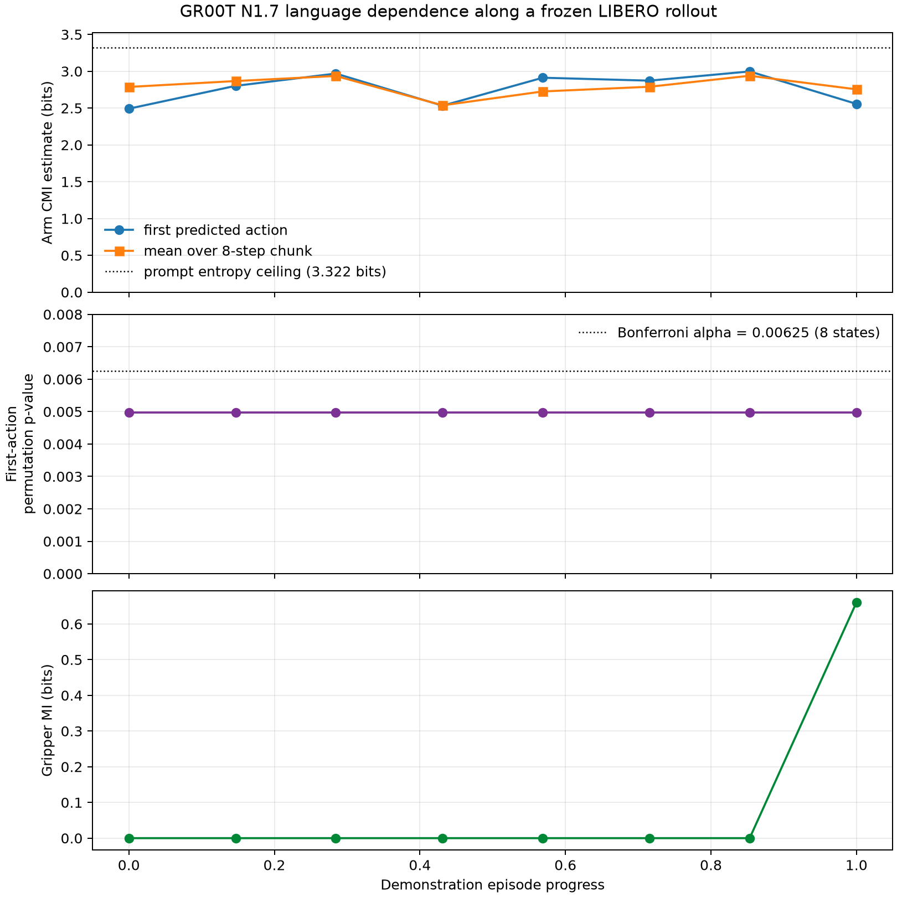
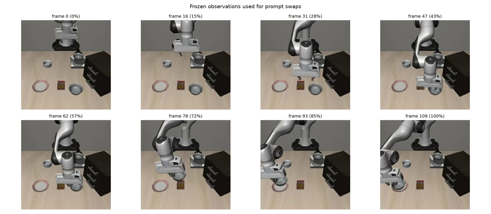

# Does GR00T Stop Listening? A Frozen-State CMI Probe on LIBERO

## TL;DR

I ran a small conditional-mutual-information probe on NVIDIA's GR00T N1.7
inside the LeRobot ecosystem. I froze eight observations from one
LIBERO-Spatial demonstration, swapped all ten task prompts at every
observation, and drew eight stochastic action samples per prompt.

The pilot did **not** find an instruction-blind stage. First-action arm CMI had
a median estimate of **2.837 bits** (range **2.492–2.998**) against the maximum
**3.322 bits** available from ten uniformly weighted prompts. Every probed
state rejected the prompt-label permutation null at the smallest p-value
available with 200 permutations, **p = 1/201 = 0.00498**. All eight remain
below the Bonferroni threshold for the eight primary state probes,
**0.05/8 = 0.00625**.

That is evidence that the action distribution changes with the instruction. It
is not evidence that the model interprets every counterfactual instruction
correctly.



## Why GR00T and LIBERO-Spatial?

LeRobot 0.6 exposes GR00T N1.7 as a flow-matching vision-language-action
policy. The published LIBERO-Spatial checkpoint consumes two camera images and
an eight-dimensional robot state, then predicts seven-dimensional action
chunks. Its model card reports 91% preliminary success on LIBERO-Spatial over
at least 50 episodes.

LIBERO-Spatial is especially convenient for a first language intervention. Its
ten tasks hold the manipulated object and destination almost fixed—the black
bowl and the plate—while changing the bowl's spatial relation. The selected
LeRobot dataset contains 432 demonstrations and 52,970 frames. This gives a
compact prompt pool whose main source of variation is easy to explain.

Sources: [LeRobot GR00T guide](https://huggingface.co/docs/lerobot/groot),
[LeRobot LIBERO guide](https://huggingface.co/docs/lerobot/main/libero),
[GR00T LIBERO-Spatial checkpoint](https://huggingface.co/nvidia/gr00t17-lerobot-libero_spatial-640),
and [LIBERO-Spatial dataset](https://huggingface.co/datasets/IPEC-COMMUNITY/libero_spatial_no_noops_1.0.0_lerobot).

## The question

Suppose the robot is already moving through a task. Does its next-action
distribution still depend on language, or does the current visual and
proprioceptive state dominate so completely that swapping the instruction has
no detectable effect?

For one fixed observation, the target quantity is

\[
I(A;L\mid S=s)
= H(A\mid S=s)
- \mathbb{E}_{L}\left[H(A\mid S=s,L)\right].
\]

I treat the ten instructions as a uniform intervention distribution. With ten
prompts, the result cannot exceed the prompt entropy
\(H(L)=\log_2 10=3.322\) bits.

## Experimental design

I selected episode 0, whose original task is:

> Pick up the black bowl next to the cookie box and place it on the plate.

Eight observations were spaced uniformly across its 110 frames. At each frozen
observation, I supplied every LIBERO-Spatial prompt and sampled GR00T eight
times. Each sample produced a 16-step, seven-dimensional action chunk; the
reported horizon analysis uses its first eight steps.

The six arm dimensions are continuous. I standardize them with one pooled,
prompt-independent affine transform and estimate CMI with shared-bandwidth,
leave-one-out Gaussian KDE through the implied prompt posterior. The final
gripper coordinate is binarized and analyzed separately with categorical
mutual information. A 200-replicate prompt-label permutation test is the
finite-sample null.



## What happened

| Quantity | Pilot result |
| --- | ---: |
| Prompt entropy ceiling | 3.3219 bits |
| Median first-action arm CMI | 2.8372 bits |
| First-action arm CMI range | 2.4918–2.9976 bits |
| States clearing permutation null | 8 / 8 |
| First-action states passing Bonferroni correction | 8 / 8 |
| Exploratory action-step/state pairs clearing uncorrected null | 64 / 64 |
| Peak first-action estimate | 2.9976 bits at 85.3% progress |
| First-action gripper MI | 0 in 7 / 8 states; 0.6605 bits at the final state |

The arm result is high throughout the episode. The median is about 85% of the
maximum information the ten-prompt intervention can expose. It does not fade
near the grasp or transport phases. On this episode, the continuous action
sampler remains readily distinguishable by prompt from beginning to end.

The gripper tells a different story. Its first command is identical across
prompts at seven observations. Only the final observation shows prompt-linked
gripper variation. Separating the categorical gripper from the continuous arm
is therefore important; a single joint Gaussian summary would hide this
structure.

## A small-sample warning

I recomputed the first-action estimate from nested subsets of the saved samples:

| Samples per prompt | Median CMI across states |
| ---: | ---: |
| 2 | 2.5851 bits |
| 4 | 2.7379 bits |
| 8 | 2.8372 bits |

The qualitative conclusion is stable even at low sample counts, but the
increasing magnitude says N=8 is not a convergence study. A stronger run should
use at least 32–64 samples per prompt and repeat the calculation across model
sampling seeds.

There is also a subtle reporting trap. A leave-one-out KDE estimate has a
negative finite-sample permutation-null median in this high-dimensional,
small-N setting. Subtracting that null median produces a useful effect score,
but it can exceed 3.322 bits and therefore must not be called mutual
information. The released CSV names it `null_centered_score_bits`; all claims
above use the bounded raw `cmi_bits` estimate.

## What this result does—and does not—say

The defensible statement is:

> Under counterfactual prompt swaps at eight frozen states from one
> LIBERO-Spatial demonstration, GR00T N1.7's arm-action distribution remained
> strongly language-dependent.

Three stronger statements are not yet justified:

1. **“GR00T follows the counterfactual prompts correctly.”** High CMI measures
   sensitivity, not semantic correctness. The policy could react for the wrong
   reason.
2. **“GR00T never becomes instruction-blind.”** This is one episode from one
   suite, with eight observations.
3. **“High CMI predicts task success.”** The intervention freezes states from
   a demonstration instead of executing counterfactual closed-loop rollouts.

Most swapped spatial descriptions contradict the rendered scene. That is
useful for a causal sensitivity probe, but it is out of distribution. A policy
that ignores an impossible instruction is not necessarily defective, and a
policy that reacts strongly is not necessarily well grounded.

## Reproduce it

The experiment uses an isolated, locked environment:

```bash
cd /home/ali/projects/steerable/experiments/groot_cmi
uv sync
uv run steerable-groot-cmi \
  --output-dir ../../artifacts/groot_cmi/libero_spatial_ep0 \
  --dataset-root ../../data/groot_cmi/libero_spatial \
  --episode 0 \
  --num-frames 8 \
  --samples-per-prompt 8 \
  --max-prompts 10
```

Model, base-model, processor, and dataset revisions are pinned in
`run_manifest.json`. One access caveat is recorded there: the checkpoint names
a gated `nvidia/Cosmos-Reason2-2B` processor repository, so this run used pinned
public, architecture-compatible `Qwen/Qwen3-VL-2B-Instruct` tokenizer and
vision-processor assets. This substitution should be eliminated or separately
validated before treating the pilot as a benchmark result.

The dataset is also an older LeRobot v2.1 release, whereas LeRobot 0.6's
generic dataset loader expects v3.0. The harness reads the exact pinned Parquet
and MP4 episode files through a narrow read-only adapter rather than silently
converting or replacing the dataset.

## The next experiment

The next iteration should cross three axes:

- several episodes from each of the ten LIBERO-Spatial tasks;
- 32–64 samples per prompt with multiple sampler seeds;
- frozen-state CMI paired with counterfactual closed-loop rollout success.

I would also add prompt controls: the true instruction, paraphrases of the true
instruction, plausible distractors, impossible distractors, and a blank prompt.
That would separate invariance to wording from sensitivity to task semantics.
The interesting blog question then becomes richer than “does language change
the action?”: **when language changes the action, is the change grounded,
useful, and predictive of success?**
