# Does the world model listen?

## A matched VLA-versus-WAM study of direct language steerability

*Ali Adeeb Abbas · Senior Scientist, General Motors*

*Personal research analysis; views are my own.*

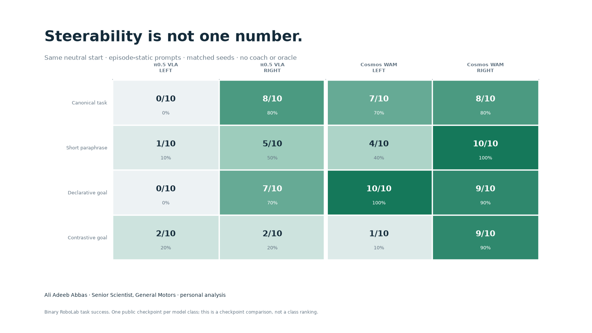

*Completed evidence package, 2 August 2026. The registered 160-episode
direct-language grid, 752-chunk semantic pass, and frozen human audit are all
closed before the claims below are compiled.*

The first plot looked encouraging. I held a robot observation fixed, changed
the instruction from left to right, and saw the action tensor and imagined
video change. The heatmap was colorful, the diagonal was dark, and the
unrelated control was far away.

It was also almost useless as evidence of steerability.

A model can react to a string without following it. Sampling noise can change
an action. A noun can change a video more than a spatial relation. A generated
future can move pixels while preserving the wrong object relation. Even a
directionally different first action can wash out after several closed-loop
replans. The useful question is not whether language changes the output. It is:

> With the observation, physical history, sampling schedule, task geometry,
> and action schema held fixed, does changing the command cause the requested
> outcome?

This study rebuilds the experiment around that question. It takes the command
taxonomy and evaluation philosophy from Chen et al.'s
[Steerable Vision-Language-Action Policies for Embodied Reasoning and
Hierarchical Control](https://arxiv.org/abs/2602.13193), then asks what changes
when the low-level model is a world-action model (WAM) that predicts both
actions and video.

The registered comparison is intentionally narrow and exact: the public
simulation-converted [π0.5 DROID](https://github.com/Physical-Intelligence/openpi)
joint-position checkpoint is the VLA, NVIDIA's public 4B
[Cosmos3 Edge DROID checkpoint](https://huggingface.co/nvidia/Cosmos3-Edge-Policy-DROID)
is the WAM,
and both control the same DROID robot from a byte-identical neutral RoboLab
reset state. Eighty originally preregistered episodes test left/right direction
and a short paraphrase. A separately disclosed, prospectively frozen
post-interim tier adds 80 episodes with declarative goal language and a
contrastive instruction containing both direction words. Every episode uses
one direct task prompt at the checkpoint's native horizon; there is no subtask
coach, privileged oracle, or prompt switching. Two fixed-observation probes
cover all six command styles and four negative controls. Cosmos's generated
futures are scored by a frozen, prompt-blind semantic pipeline.

The result is not a universal leaderboard. One checkpoint cannot represent a
whole model class. It is a methodical case study of what two public systems can
and cannot support today—and a reusable benchmark for testing more of them.

## Executive result

Neither tested checkpoint is robustly steerable across direction and wording.
Cosmos completed 58/80 direct-language episodes and π0.5 completed 25/80,
but both totals hide large handedness and syntax effects: π0.5 was 3/40 LEFT
versus 22/40 RIGHT, while Cosmos was 22/40 LEFT versus 36/40 RIGHT and collapsed
from 19/20 declarative to 10/20 contrastive. Of the 77 combined failures, 53
picked up the cube but never entered the requested goal. The dominant failure
was therefore grounded placement, not simply inability to grasp.

Cosmos's WAM output is informative but not a dependable semantic monitor. The
prompt-blind scorer could label 421/752 action/future horizons; among those it
found 22 cases where imagination and execution both reached the request, five
where only imagination did, three where only execution did, and 391 where
neither did. The apparent 98.1% agreement is dominated by early neutral
horizons. Crucially, the evaluator could score only 25/97 horizons in which
execution actually reached the requested relation. The honest result is a
qualified sign of action/future coupling with a severe positive-event coverage
limit—not proof that generated video reliably predicts success.

The practical recommendation has two layers:

1. **Use Efficient-WAM-RT as the rapid intervention core.** Its roughly
   0.137-second warm action chunks and byte-identical after-grasp intervention
   evidence make it the most productive local substrate here. Treat its strong
   direction and abstraction asymmetries as research targets, not solved
   behavior.
2. **Use Cosmos as the slower WAM cross-check and π0.5 as the VLA control.**
   Cosmos supplies inspectable generated futures in the matched DROID setup;
   π0.5 supplies an action-only baseline. Light-WAM is the next lightweight
   checkpoint worth bringing through the same protocol. None is ready to be
   treated as a reliable free-form language-control layer.

## What steerability means

I use six claims that are often collapsed into one word:

| Level | Claim | Minimum evidence |
| --- | --- | --- |
| 1 | Repeatability | Exact input and sampling state reproduce exactly |
| 2 | Sensitivity | A command change exceeds same-command noise |
| 3 | Semantic direction | The change points toward the requested outcome |
| 4 | Task competence | The checkpoint solves its released/native task |
| 5 | Closed-loop control | A matched counterfactual completes the requested goal |
| 6 | Robust steerability | Control survives directions, seeds, scenes, wording, objects, and abstraction levels |

The original heatmap reached level two at best. A publishable claim about
steerability needs levels three through five, and a general claim needs level
six.

This distinction is stricter for a WAM than for a standard VLA. A VLA has one
observable obligation: produce actions that achieve the command. A WAM makes
two coupled promises: act, and imagine the future associated with the action.
It can therefore fail in four semantically different ways:

| Imagined future | Executed action horizon | Interpretation |
| --- | --- | --- |
| requested | requested | action and world prediction agree |
| requested | not requested | the model imagines correctly but its action does not realize it |
| not requested | requested | the policy succeeds despite an inconsistent world prediction |
| not requested | not requested | neither output follows the requested relation |

Pixel MAE cannot distinguish these quadrants. The most WAM-specific question
in this study is whether the predicted future satisfies the requested
predicate and whether execution agrees.

## The command interface from the paper

Chen et al. train low-level policies on six command styles:

1. **Task:** complete task language, such as “put the carrot in the pot.”
2. **Subtask:** a semantic component, such as “reach for the carrot.”
3. **Atomic motion:** a low-level movement without task semantics, such as
   “move left” or “open gripper.”
4. **Gripper trace:** an image-space sequence of points for the gripper to
   follow.
5. **Point:** a grounded object or interaction location.
6. **Combination:** a hybrid of language, motion, point/trace, and gripper
   state.

Their full evaluation contains in-distribution, motion, spatial, and semantic
generalization splits. The main closed-loop metric is success rate. Their
multi-step in-context experiment reports task progression as the mean of a
task-specific list of binary rubric items. Those items need not occur in order,
and credit is revoked when a state is undone, except that first interaction or
pickup credit persists.

The paper's spatial example has two items: pick up the correct object, then put
it down in the correct location. Its learned embodied reasoner is queried every
five environment steps; its off-the-shelf in-context VLM every twenty steps;
human-oracle interventions are separated by at least two seconds. Grounded
coordinates are normalized to 0–255.

This study copies those ideas but does not pretend to reproduce the paper's
Bridge robot, training mixture, or four evaluation splits. It covers one
spatial slice. It also deliberately does **not** copy the paper's learned
reasoner or human-oracle experiments. Those answer whether a high-level system
can select useful low-level commands. Here the question is narrower: does the
released checkpoint itself ground the user's task language without privileged
state or a coach?

## Why an ordinary VLA/WAM leaderboard would be invalid

The public models differ in training corpus, embodiment, action coordinates,
camera layout, horizon, parameter count, future representation, and simulator.
Running each model's favorite benchmark and placing the percentages in one
table would confound almost everything.

The shared direct-language comparison removes the largest confounds:

- same DROID joint-position-plus-gripper action schema;
- same simulator, task objects, camera geometry, and 450-step limit;
- same neutral object arrangement, where neither left nor right is initially
  true;
- same ten policy-sampling seeds per prompt condition;
- request seed `episode_seed * 1000 + replan_index`;
- same success predicate, paper-style progression, and evidence compiler;
- left and right task variants differ only in the requested predicate and
  instruction;
- one environment at a time to keep episode-level evidence auditable.

This matches physical state and renderer configuration, not exact rendered
pixels. A post-freeze integrity check found reset-to-reset realtime-renderer
variation; the observation amendment quantifies it and narrows the secondary
first-action claim. The primary closed-loop outcomes and the byte-identical
fixed-observation probe remain interpretable.

The models retain their native action horizons—15 for π0.5 and 32 for Cosmos—
in every analyzed episode. This avoids introducing a horizon-five distribution
shift merely to support a controller that is outside the revised question.

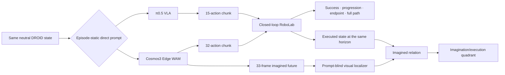

## The registered study—and the disclosed scope change

The original design was committed before confirmation inference. Its direct
task grid is:

```text
2 models × 2 wordings × 2 directions × 10 seeds = 80 episodes
```

After all 40 Cosmos outcomes in that grid and preliminary five-step evidence
were visible, I removed the privileged controller from the study. I did not
rewrite history. The dated scope amendment lists every known outcome and
freezes a separate stress tier before any of its episodes:

```text
2 models × 2 stress wordings × 2 directions × 10 new seeds = 80 episodes
```

The four direct task wordings are:

```text
Put the rubiks cube to the left of the bowl
Put the rubiks cube to the right of the bowl

Put the cube left of the bowl
Put the cube right of the bowl

The rubiks cube should end up to the left of the bowl
The rubiks cube should end up to the right of the bowl

Put the rubiks cube to the left of the bowl, not to the right of the bowl
Put the rubiks cube to the right of the bowl, not to the left of the bowl
```

The shorter wording removes “rubiks” and “to the.” It catches dependence on a
training-like caption. The declarative wording asks whether an end-state
description is grounded like an imperative. The contrastive wording is the
hardest semantic test: both “left” and “right” are present, but one relation is
explicitly negated. A bag-of-direction-words response can change; a steerable
policy has to obey the scope.

The original canonical/short tier remains confirmatory. The
declarative/contrastive tier is post-interim and is never retroactively called
part of the original preregistration. Retired five-step outputs remain in an
excluded/supporting ledger and contribute zero analyzed episodes.

The fixed-observation probe reuses one hash-pinned neutral calibration image
and one seed for both models. It includes task, subtask, atomic motion, point,
trace, and combination commands, plus exact repeat, paraphrase, opposite
relation, unrelated command, noun swap, and contradiction controls. Point and
trace coordinates are projected from simulator ground truth and normalized to
0–255 before any model request.

The paper appendix is internally inconsistent about the coordinate origin: it
defines the first coordinate as the column from the left and the second as the
row from the top, then calls `[0,0]` the top-right. This benchmark adopts the
conventional top-left origin implied by the row/column definition and records
that choice instead of silently guessing.

A supplemental exact-input probe narrows in on the four task wordings. It adds
contrastive target-first and target-last variants while holding input pixels,
robot state, and sampling seed byte-for-byte fixed. This can reveal a lexical
order heuristic that closed-loop success proportions alone cannot isolate.

## Metrics and what they do not say

### Primary metrics

Binary success is the official RoboLab requested-side termination: the cube is
inside the requested 45-degree robot-frame cone, within 0.1 m in height of the
bowl, and detached from the gripper.

Paper-style progression has two equally weighted items:

1. the correct Rubik's cube was successfully picked up at least once; this
   credit persists;
2. the official requested-side success predicate is true, including release.

The study reports each numerator and denominator, separates direction and
wording, and places a 95% Beta(1,1) posterior credible interval beside each
observed success proportion. With only ten episodes per bar, wide intervals
are a feature, not an inconvenience to hide.

### Declared secondary metrics

- strict pick-then-place progression, which requires a post-pick transition
  into the requested relation;
- relation-only progression without the release requirement;
- signed final cube-minus-bowl offset, oriented so positive always means the
  requested side;
- first-chunk opposite-prompt RMS and same-prompt sampling RMS;
- paraphrase retention and directional asymmetry;
- inference time, wall time, GPU memory, disk, and setup burden;
- for Cosmos, imagined/executed semantic quadrants and scorer coverage.

Action RMS and pixel MAE remain diagnostics. They are never promoted to
success. Exact paired McNemar tests are exploratory, reported without
multiplicity correction. Replan chunks from one episode are correlated, so the
semantic quadrant rates are descriptive and do not receive fake binomial
confidence intervals.

## A prompt-blind semantic scorer for generated futures

Cosmos emits a 33-frame imagined video with each 32-action chunk. Frame zero is
the conditioning image, so it never counts as forecast evidence. Frames 8, 16,
24, and 32 are scored.

Those dimensions are not an arbitrary stretch of a 16-step model. The current
public model card separates its canonical 16-action configuration from a
32-action realtime PyTorch configuration. The locally pinned snapshot's own
`checkpoint.json` declares a 32-action chunk and 15 Hz conditioning, matching
the latter. The confirmation server uses four UniPC denoising steps, guidance
3.0, and the checkpoint's 8D DROID joint-position-plus-gripper action schema.
The exact server command is preserved in the runbook.

A local [Qwen3-VL-2B-Instruct](https://huggingface.co/Qwen/Qwen3-VL-2B-Instruct)
model sees one third-person camera panel at a time
and only this object-localization request: find the multicolored cube and red
bowl. It never sees the policy instruction or requested direction. The target
relation comes from the authoritative left/right simulator task identity, not
from asking the scorer to interpret the contrastive prompt's negation. Exact
RoboLab camera intrinsics and extrinsics project the two centroids to the table
plane. Both over-shoulder cameras must agree on the categorical relation and
their two reconstructed positions must agree within a frozen 0.20 m threshold.
This is strictly offline measurement after the rollout; the localizer never
selects a command, changes an action, or feeds information back to either
policy.

A chunk needs at least two reliable frames. At least 75% requested frames means
`imagined requested`; at most 25% means `did not imagine requested`; the middle
and insufficient-coverage cases abstain.

All thresholds came from excluded 51xx calibration rollouts. On 19 conditioning
frames, the two-camera relation agreed with simulator truth on 18 (94.7%). The
excluded dry run produced 78.9% chunk coverage and placed its only positive
quadrant on the final chunk of the successful-right rollout. Confirmation
labels are also replayed with stricter 0.10 m and 0.15 m cross-camera thresholds
as a robustness audit; the frozen 0.20 m labels never change.

The scorer's limits matter. It is an auditable proxy, not ground truth for the
generated video. Occlusion, object deformation, and the planar approximation
can force abstention or error. It also scores the recorder's decoded 15 fps MP4,
not a pre-encoding latent or raw generator tensor, so video compression is part
of the measured interface. That is why coverage and contact-sheet overlays ship
beside the result.

## Direct-language closed-loop result

| Episode-static wording | π0.5 VLA LEFT | π0.5 VLA RIGHT | Cosmos WAM LEFT | Cosmos WAM RIGHT |
| --- | ---: | ---: | ---: | ---: |
| Canonical task | 0/10 | 8/10 | 7/10 | 8/10 |
| Short paraphrase | 1/10 | 5/10 | 4/10 | 10/10 |
| Declarative goal | 0/10 | 7/10 | 10/10 | 9/10 |
| Contrastive goal | 2/10 | 2/10 | 1/10 | 9/10 |

The scorecard keeps the raw numerators visible. The interval plot below makes
the corresponding uncertainty impossible to miss; ten trials per cell are
enough to expose large brittleness, not to estimate deployment reliability
with precision.

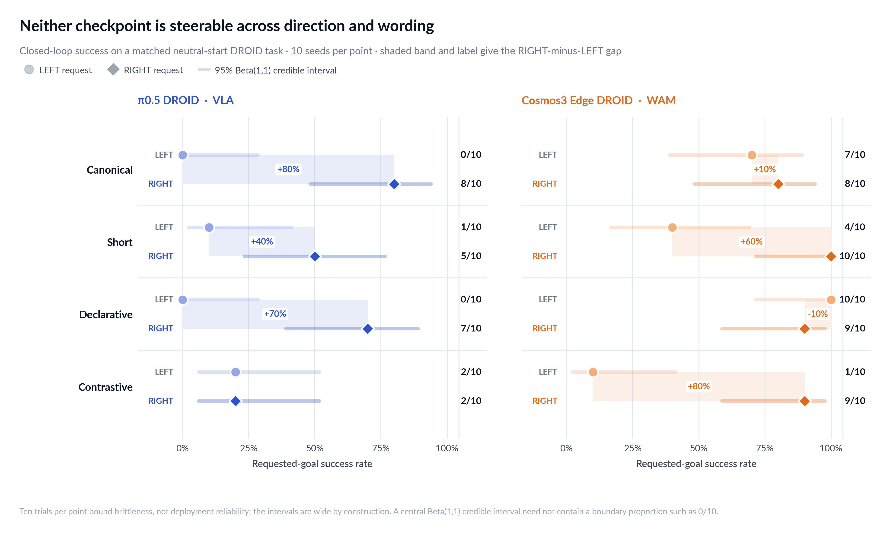

Across the full grid, π0.5 succeeded in **25/80** episodes and Cosmos in
**58/80**. Those totals are descriptive checkpoint results, not a VLA-versus-
WAM class ranking: the checkpoints retain different native horizons and only
one member of each class is present. The direction breakdown is more revealing
than either total. π0.5 succeeded on 3/40 LEFT requests and 22/40 RIGHT
requests. Cosmos succeeded on 22/40 LEFT and 36/40 RIGHT requests.

The individual prompt cells show why “supports language” is too coarse a
claim. Cosmos ranged from 10/10 for a declarative LEFT goal and a short RIGHT
command to 1/10 for contrastive LEFT. π0.5 ranged from 8/10 for canonical
RIGHT to 0/10 for canonical and declarative LEFT. All bars have only ten trials;
the displayed Beta(1,1) intervals correctly remain wide. The compelling signal
is the repeated, paired structure of the asymmetry, not false precision about
its population rate.

### Paper-style task progression

The paper's two-item spatial rubric gives persistent credit for picking up the
correct object, then a second point for satisfying the requested placement.
Reporting it alongside terminal success separates manipulation competence from
language-grounded placement:

| Checkpoint | Request | Correct pickup | Terminal placement | Mean two-item progression |
| --- | --- | ---: | ---: | ---: |
| π0.5 VLA | LEFT | 20/40 | 3/40 | 28.8% |
| π0.5 VLA | RIGHT | 37/40 | 22/40 | 73.8% |
| Cosmos WAM | LEFT | 39/40 | 22/40 | 76.2% |
| Cosmos WAM | RIGHT | 40/40 | 36/40 | 95.0% |

Across directions, mean progression was 51.3% for π0.5 and 85.6% for
Cosmos. That does **not** mean Cosmos placed the cube correctly 85.6% of the
time: it earned the persistent pickup half-credit in 79/80 episodes. The strict
pick-then-place means were 51.3% and 85.0%; the relation-only means were 51.3%
and 86.2%. Their closeness confirms that the main distinction is requested
placement versus no requested placement, not a large accounting artifact.

The endpoint distribution includes failures and is therefore a useful check
against a lucky termination event:

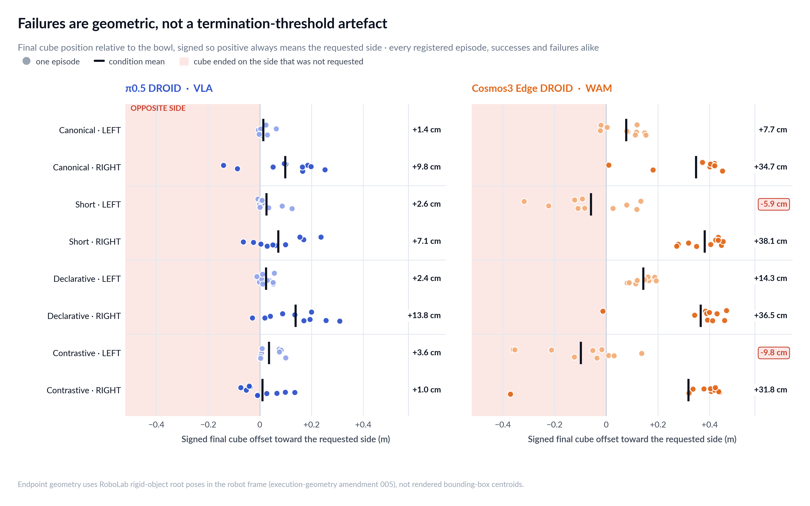

The signed endpoint tells the same story before the strict release predicate is
applied. Positive always means “toward the requested side.” Cosmos's mean
offset was +7.7 cm for canonical LEFT and +14.3 cm for declarative LEFT, but
**−5.9 cm** for short LEFT and **−9.8 cm** for contrastive LEFT: in those
two conditions the average endpoint was literally on the opposite side. Its
corresponding RIGHT means were +34.7, +38.1, +36.5, and +31.8 cm. π0.5's LEFT
means were all weakly positive (+1.4 to +3.6 cm), while its first three RIGHT
means were +7.1 to +13.8 cm; contrastive RIGHT collapsed to +1.0 cm. This makes
the failures geometric rather than merely a termination-threshold artifact.

## From a score to a visible path

A binary score says whether a rollout ended correctly. It does not show *how*
the model failed. For every registered episode, I therefore transform the saved
cube root pose into the robot frame, place the bowl at the origin, and draw the
entire executed cube path. The page is deliberately intuitive: robot-left is
left on the page and robot-right is right.

The shaded 45-degree cone is the expected **goal region**. The dashed green
arrow is only an illustrative direct route from the initial cube position to a
fixed point inside that region. It is not an oracle trajectory, does not enter
any metric, and is not the only valid route. The task permits any collision-free
path that ends with the cube released inside the requested cone.

The primary paired display uses the lowest registered stress seed for both
checkpoints and both wordings. That deterministic rule is fixed across all four
panels; it is not a best-looking-example search.

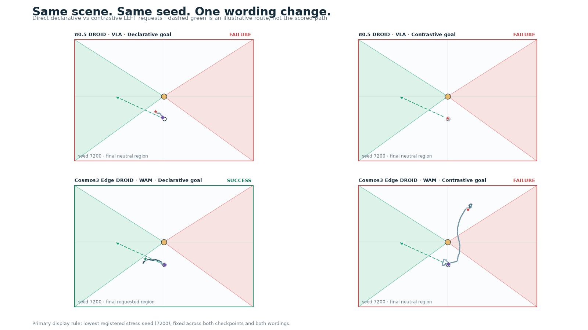

The aggregate view then plots all 160 paths and endpoints. Successful LEFT and
RIGHT trials keep distinct marker shapes; every failure remains a red ×. This
is the visual antidote to a cherry-picked rollout montage.

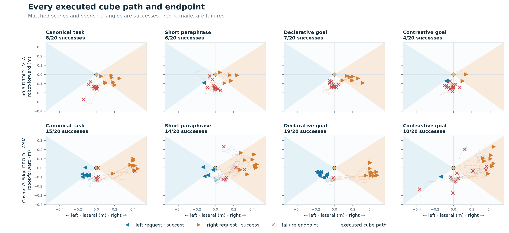

Finally, each episode receives one mutually exclusive terminal diagnosis:
no cube interaction; interaction without a verified pickup; pickup without
ever entering the goal; entry followed by losing the relation; ending in the
goal without satisfying the terminal release predicate; or success. This turns
“failure” into an actionable engineering description.

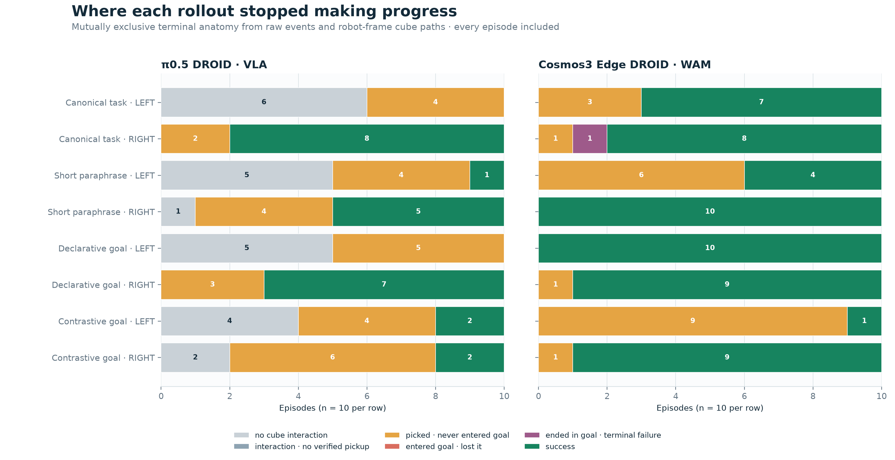

The anatomy is unusually clean in this task. Of 77 failures, 53 picked up the
cube but never entered the requested goal, 23 never produced a verified cube
interaction, and one ended geometrically inside the goal without satisfying
the full terminal condition. No rollout entered the goal and later lost it.
That distribution rules out “the robot just cannot grasp” as a sufficient
explanation for the main result: most failures progressed past pickup and then
placed or retained the cube in the wrong region.

The [complete filterable gallery](../artifacts/vla_wam_shared_v1/trajectory_evidence/gallery/index.html)
and its CSV/JSON index expose every seed, instruction, endpoint class, event
step, source HDF5/log path, and rendered panel. Retrospective exemplars are
explicitly labeled as such and carry no inferential weight.

### What the action contrast adds

On the first closed-loop chunk, opposite-prompt action separation was smaller
than the same-prompt seed-plus-render baseline in every condition. The effect-
to-baseline ratios were 0.118–0.373 for π0.5 and 0.409–0.622 for Cosmos. The
contrastive π0.5 condition was the weakest at 0.118. These numbers do not say
that language had no effect; they say this *particular non-byte-identical
closed-loop contrast* cannot isolate it from renderer, settling, and sampling
variation. That is why it remains a diagnostic beside the causal exact-input
probe, not a headline steerability metric.

All 160 analyzed episodes share one exact **physical** reset fingerprint across
the robot and rigid objects. A fail-closed preview also exposed two hashes for
the complete recorded reset group: Cosmos stores head and right-shoulder camera
poses that the π0.5 recorder omits. Every one of the 18 datasets shared by both
schemas is byte-identical; the difference is observation bookkeeping, not a
different scene. The correction and exact dataset names are preserved in the
initial-state schema amendment.

That exact physical reset still does **not** produce byte-identical first
observations. Objects can settle by millimeters before the first recorded
action: the first two same-direction resets differed by 3.50 mm at the cube,
while the matched seed-6100 left/right centroids were exact. Their conditioning
frames still differed by 1.60/255 MAE; two same-direction resets differed by
4.27/255. The closed-loop opposite-prompt distance therefore contains prompt,
settling, *and renderer* variation, while the same-prompt baseline contains
sampling plus the same nuisance variation. Their ratio remains a sensitivity
diagnostic, not a causal language estimate. The fixed-observation probe below
is the exact byte-level intervention. Closed-loop requested-goal success remains
the important outcome.

A second integrity check caught a subtler derived-metric bug before any
confirmation future was semantically scored. The task predicate uses rigid-
object root poses, but the first compiler used rendered bounding-box centroids;
cube rotation can shift those centroids across the 45-degree boundary. The
dated execution-geometry amendment switches endpoint and executed-state
relations to root poses in the robot frame, leaves visual calibration on visual
centroids, and changes no binary success, prompt, action, future, or inclusion
decision.

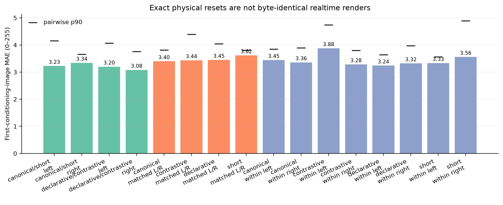

## The six-style fixed-observation probe

Before the broader taxonomy, the direct task-language subset gets its own
exact-input check:

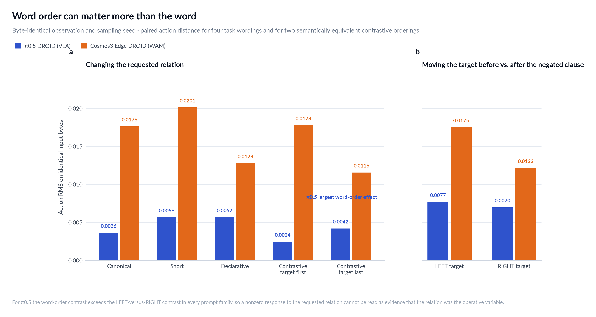

Both endpoints exactly reproduced the repeated canonical request: action RMS
was 0.0 for each model, and Cosmos's repeated future-video pixel MAE was also
0.0. With identical observation bytes and sampling seed, changing LEFT to
RIGHT produced nonzero action RMS for every wording:

| Prompt family | π0.5 action RMS | Cosmos action RMS | Cosmos future MAE (0–1) |
| --- | ---: | ---: | ---: |
| Canonical | 0.003624 | 0.017621 | 0.021664 |
| Short | 0.005644 | 0.020121 | 0.018229 |
| Declarative | 0.005671 | 0.012777 | 0.016961 |
| Contrastive, target first | 0.002444 | 0.017773 | 0.020313 |
| Contrastive, target last | 0.004181 | 0.011555 | 0.017360 |

That establishes deterministic prompt sensitivity on the frozen input. It does
not establish that the response points in the right semantic direction. The
order control is the warning: moving the same target relation from before to
after the negated distractor changed π0.5 actions by 0.007679 (LEFT target)
and 0.006964 (RIGHT), larger than its LEFT-versus-RIGHT effect in every prompt
family. Cosmos's order effects, 0.017506 and 0.012151, were comparable to its
relation effects. Both checkpoints therefore encode lexical scope/order in a
way that can be at least as consequential as the requested relation itself.

The left/right bars ask whether each wording separates requested directions.
The word-order bars compare semantically equivalent contrastive prompts with
the target relation before versus after the negated distractor. Neither is a
success metric; they diagnose why a closed-loop condition may succeed or fail.

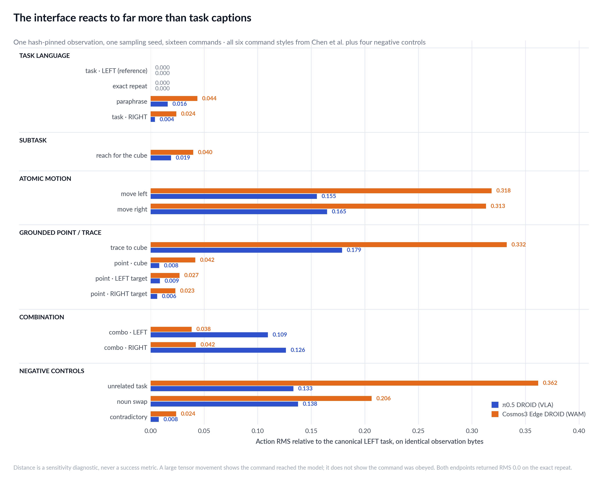

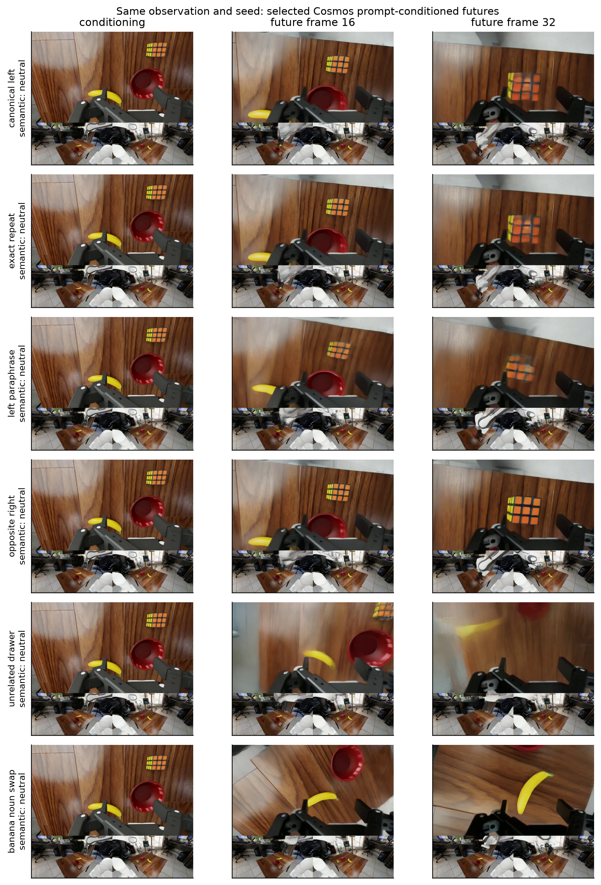

The prompt-blind semantic check is deliberately less flattering than the pixel
metric. All 11 exact-input task-wording futures were reliably classified as
cube–bowl **neutral** over frames 8, 16, 24, and 32. Thus every LEFT/RIGHT
condition changed pixels, but none imagined the requested terminal relation
inside that one action horizon. A full task normally takes several replans from
reset, so this is not a failed full episode; it is direct evidence that a
nonzero future-video MAE cannot be read as semantic goal completion.

The broader six-style probe was also exactly repeatable. Its paired LEFT-versus-
RIGHT action RMS was:

| Command style | π0.5 VLA | Cosmos WAM |
| --- | ---: | ---: |
| Full task | 0.004000 | 0.023909 |
| Atomic motion | 0.019037 | 0.181780 |
| Grounded point | 0.007563 | 0.013054 |
| Combination | 0.022663 | 0.049218 |

So both released interfaces react strongly to more than task captions, and the
largest tensor movement is not necessarily attached to the richest semantic
command. Cosmos's paired future MAE was 0.023538 for task, 0.042615 for atomic
motion, 0.016445 for point, and 0.038484 for combination. Those are useful
interface diagnostics, not proof that an atomic, point, or combination command
was obeyed. The prompt-blind evaluator classified all 16 rich-probe futures as
neutral. For the eight conditions where the cube–bowl relation was the declared
target—task, relation paraphrase/opposite, spatial point, and combination—that
means 0/8 imagined the requested relation within one horizon. The other eight
do not have that target and are not mislabeled as semantic failures. The
semantic scorer below adds a cube–bowl predicate only where that predicate is
actually the command's target.

The semantic future scorer is applied only where its target matches the
command: task, relation paraphrase/opposite, spatial-point, and combination
commands. It does not score “move the gripper left” as though that meant “put
the cube left of the bowl.” Subtask, atomic, trace, unrelated-object, and
contradictory prompts remain sensitivity diagnostics unless a matching
task-specific semantic metric exists.

This limitation is itself instructive. A rich command interface requires a
metric suite rich enough to distinguish end-effector motion, grasp state,
object identity, traces, points, and full task success. One left/right object
predicate cannot stand in for the paper's six styles.

The lone subtask condition here is a one-request, fixed-observation interface
diagnostic. It is never selected from simulator state, never switched during a
rollout, and never enters closed-loop success. In other words, the study has no
subtask coach even though it still documents whether the released endpoint
reacts to a subtask-form string.

## Does the WAM imagine what it executes?

At the frozen 0.20 m two-camera threshold, the 752 replan chunks divide as
follows. `Both` means the generated future and executed 32-action horizon reach
the request; `future only` and `execution only` are the two mismatch modes;
`neither` is a certain negative; and `uncertain` is an evaluator abstention.

| Wording | Request | Chunks | Certain coverage | Both | Future only | Execution only | Neither | Uncertain |
| --- | --- | ---: | ---: | ---: | ---: | ---: | ---: | ---: |
| canonical | LEFT | 99 | 51/99 | 1 | 2 | 0 | 48 | 48 |
| canonical | RIGHT | 86 | 54/86 | 6 | 1 | 0 | 47 | 32 |
| short | LEFT | 125 | 71/125 | 1 | 0 | 1 | 69 | 54 |
| short | RIGHT | 64 | 31/64 | 5 | 2 | 1 | 23 | 33 |
| declarative | LEFT | 66 | 34/66 | 1 | 0 | 1 | 32 | 32 |
| declarative | RIGHT | 87 | 47/87 | 4 | 0 | 0 | 43 | 40 |
| contrastive | LEFT | 146 | 89/146 | 0 | 0 | 0 | 89 | 57 |
| contrastive | RIGHT | 79 | 44/79 | 4 | 0 | 0 | 40 | 35 |

Overall, 421/752 chunks were certain: 22 both, five future only, three execution
only, and 391 neither. Another 331 chunks abstained. All 80 episodes had at
least one certain chunk, but only 22 had any certainly imagined-positive chunk;
58 had at least one executed-positive horizon.

The generated-video strips below are selected by a rule frozen before any
confirmation semantic label: take the first eligible chunk in registered
wording, direction, episode, and replan order for each category. Missing
categories remain visibly empty. Cyan marks the prompt-blind cube localization;
red marks the bowl. These examples explain the aggregate labels and are not
additional independent trials.

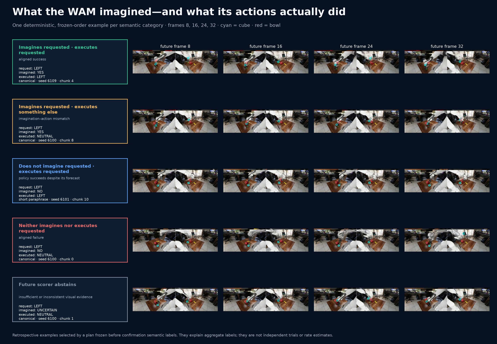

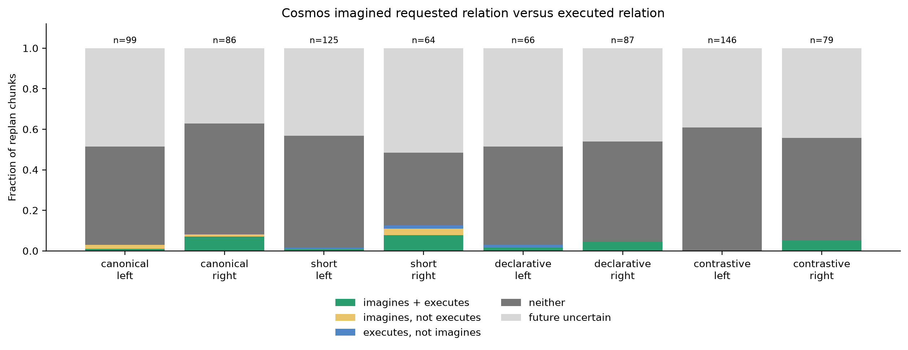

Among certain chunks, imagination and execution agreed in 413/421 (98.1%).
When the future made a positive prediction, execution agreed in 22/27 (81.5%);
among the 25 executed-positive horizons with a certain future, 22 were imagined
positive (88.0%). Those conditional numbers sound strong until coverage is
restored: execution reached the requested relation in 97 chunks, and the future
scorer abstained on 72 of them. Only **25/97**, or 25.8%, of the positive
execution events support either positive precision or recall. The 391
neutral/neutral chunks also dominate the aggregate agreement because a
full pick-and-place task usually cannot finish inside an early 32-action
horizon.

The direction pattern is nevertheless meaningful. Contrastive LEFT produced
zero certainly imagined-positive chunks across 146 replans, while contrastive
RIGHT produced four aligned positives. The closed-loop task had the same
1/10-versus-9/10 split. Conversely, declarative LEFT succeeded in all ten full
episodes but produced only one episode with any certainly imagined-positive
chunk. Generated video therefore exposes some real directional structure, yet
is too short-horizon and too often unscorable to serve as a reliable long-term
success forecast.

The frozen 24-sheet human audit reviewed 254 chunks and 1,016 frames. All 2,032
camera responses parsed; 507 frames passed reliability and 150 chunks received
a certain label. Cube or bowl markers visibly jumped to the robot, table,
banana, or background under small-object and occluded futures. Cross-camera
checks caught many of those cases, and sampled certain directional labels were
visually credible, but two-camera agreement cannot guarantee object identity.
The result is therefore a [qualified audit pass](../artifacts/vla_wam_shared_v1/semantic_confirmation_audit.md),
not an evaluator-accuracy claim.

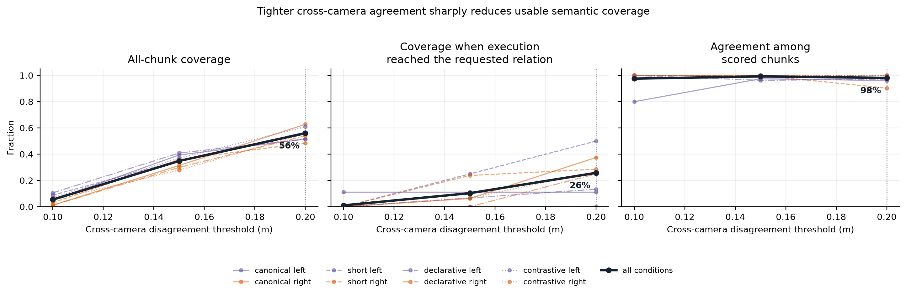

The threshold replay reinforces the limitation rather than rescuing the
headline. At 0.10, 0.15, and the frozen 0.20 m cross-camera thresholds, overall
chunk coverage was 5.5%, 34.8%, and 56.0%; coverage specifically on the 97
executed-positive horizons was only 1.0%, 10.3%, and 25.8%. Agreement among the
surviving chunks stayed at 97.6%, 99.2%, and 98.1%. A stricter threshold thus
preserves an apparently excellent agreement rate by discarding almost every
positive event. The conclusion is stable: certain labels are often consistent,
but semantic coverage—especially during successful manipulation—is the
bottleneck.

This is the measurement that a VLA-only evaluation cannot provide. It can show
whether the WAM's world prediction is useful for monitoring and planning, or
whether video generation is merely an expensive auxiliary output that is
semantically disconnected from the action policy.

## Does direct grounding survive semantic stress?

| Post-interim direct-language stress | π0.5 LEFT | π0.5 RIGHT | Cosmos LEFT | Cosmos RIGHT |
| --- | ---: | ---: | ---: | ---: |
| Declarative end-state | 0/10 | 7/10 | 10/10 | 9/10 |
| Contrastive target + negated opposite | 2/10 | 2/10 | 1/10 | 9/10 |

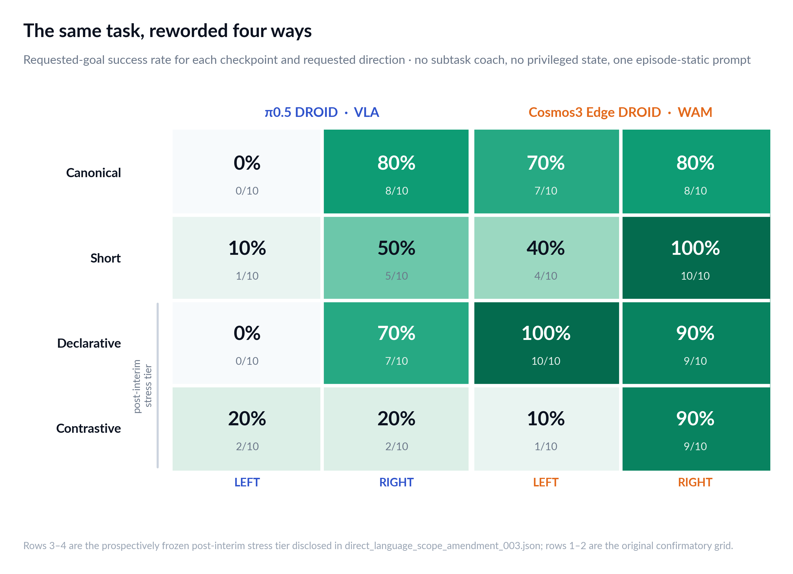

The stress tier exposes two different failures. π0.5 retained its strong
RIGHT preference under declarative language but lost it under the contrastive
form, ending at 2/10 in both directions. Cosmos understood the declarative form
almost perfectly (19/20), then fell to 10/20 when the same prompts included the
negated opposite. All nine discordant same-seed declarative/contrastive pairs
favored declarative (two-sided exact McNemar *p*=0.0039, exploratory and
uncorrected). Inside Cosmos contrastive trials, eight discordant direction
pairs favored RIGHT and none favored LEFT (*p*=0.0078). The model did not merely
become noisier: a scoped language change exposed a highly directional failure.

The declarative condition separates task semantics from familiar imperative
syntax. The contrastive condition separates scoped meaning from simple lexical
sensitivity because each prompt contains both direction tokens. Degradation
therefore has a more useful interpretation than an oracle failure: it directly
shows that the user-facing task-language interface is brittle. It still does
not refute the paper, whose policies were explicitly trained on a richer
steering-command mixture than either released checkpoint here.

## The broader WAM evidence, kept separate

The shared-grid confidence intervals contain only π0.5 and Cosmos. Earlier
experiments on Efficient-WAM, FastWAM, and LingBot-VA are retained as a
retrospective tier because they answer useful engineering questions but were
not generated by the shared frozen grid.

| WAM | Scale relevant to deployment | Evidence in this study | Local verdict |
| --- | --- | --- | --- |
| Light-WAM | 0.44B trainable plus frozen 1.3B Wan backbone | release review only | compelling next lightweight replication |
| UVA | about 0.5B | invalid early heatmap only | not yet established |
| Efficient-WAM-RT | 1B | 42 retrospective closed-loop episodes | usable causal-intervention core, asymmetric |
| Fast-WAM | not normalized here | implementation audit plus six-seed gate | language signal exists after repair, not robust |
| Cosmos3 Edge DROID | 4B | full direct-language grid | shared-benchmark WAM |
| LingBot-VA | 5.09B | retrospective native/swap gate | useful future-latent substrate, too slow for core |
| DreamZero | roughly 14B | setup/runtime experience only | later large-model confirmation |

Parameter labels are not made artificially comparable: “trainable” excludes
frozen inference weights, active parameters can exclude routed capacity, and a
checkpoint download size is not a parameter count. The behavioral columns,
not the smallest number in the second column, determine the recommendation.

Three considered models remain outside the numerical evidence table.
[UVA](https://arxiv.org/abs/2503.00200) was the smallest attractive released
joint video/action checkpoint in the initial scan at roughly 0.5B parameters,
but I do not have a schema-correct matched closed-loop LIBERO result. Its early
pairwise heatmap is the motivating failure case for this study, not positive
evidence. The newer [Light-WAM](https://arxiv.org/abs/2606.08242) release
reports 0.44B **trainable** parameters, 72.03 ms inference, and 4.1 GiB peak
memory, and now provides LIBERO and RoboTwin checkpoints. That trainable count
does not include its frozen Wan2.1-T2V-1.3B video backbone, so it is not a clean
claim of a smaller total deployed model. I have not run it under this protocol;
it is the highest-priority lightweight replication, not evidence in this table.
[DreamZero](https://dreamzero0.github.io/) is a useful large-model comparison,
but its roughly 14B-scale deployment and different action/runtime stack make it
a poor rapid local core and an invalid participant in the shared DROID grid.
Their status is *not measured under this protocol*, not zero success.

### [Efficient-WAM-RT](https://arxiv.org/abs/2606.10040): the fastest causal experimental core

On one expert-valid RoboTwin scene and three diffusion seeds per native
direction, Efficient-WAM achieved 6/6 native successes and 2/6 matched
counterfactual successes. All 6/6 paired endpoints shifted in the requested
direction. Median shifts were +15.2 cm for native-left to prompted-right and
−17.3 cm for native-right to prompted-left.

The stronger test changed language only after a verified grasp, preserving a
byte-identical 25-action prefix in all six matched groups. A full
counterfactual task succeeded 3/6, subtask 2/6, atomic motion 0/6, and combined
motion-plus-release 1/6; the same-direction control was 6/6. The aggregate
conceals a complete direction split: native-right to left was 3/3, while
native-left to right was 0/3.

Pros:

- roughly 0.137 seconds per warm action chunk;
- about 10 GB observed policy memory after moving UMT5 to CPU;
- real same-history causal command interventions;
- co-generated futures and a trainable 1B-scale core.

Cons:

- positive evidence is limited to one expert-valid scene;
- strong directional and abstraction asymmetry;
- coarse future video;
- no demonstrated structured point/trace interface;
- four of six static counterfactuals still fail.

Efficient-WAM remains the best rapid-iteration research core in this project,
not a generally reliable language controller.

### [Fast-WAM](https://arxiv.org/abs/2603.16666): a language knob that did not reach inference

The release accepted `text_cfg_scale`, but action-only and joint inference did
not use it. Repairing the positive/negative guidance passes exposed a genuine
language signal. At the best post-hoc tested scale, prompt action RMS was
0.00532 versus 0.00793 sampling RMS, a ratio of 0.67. One clean matched
counterfactual succeeded in both directions, but the swapped success reproduced
on only 1/5 diffusion seeds.

Pros:

- the code path can be repaired and audited;
- one real counterfactual shows usable signal exists;
- a valuable example of testing the implementation rather than trusting an API
  flag.

Cons:

- prompt effect remains below sampling variation;
- post-hoc guidance selection weakens the evidence tier;
- counterfactual robustness is only 1/5;
- not a dependable experimental controller.

### [LingBot-VA](https://arxiv.org/abs/2601.21998): the clearest imagined-future signal, but slow control

LingBot exactly repeated identical prompts: action RMS and predicted-latent RMS
were both zero. Left/right predicted-video-latent RMS was 0.02733, while
normalized-action RMS was 0.00116. It solved both released native tasks but
0/2 swapped tasks. One swapped trajectory crossed to the requested side before
failing strict geometry/release; the other did not cross.

Pros:

- deterministic, language-dependent future latents;
- 2/2 native competence;
- strong substrate for studying action/future coupling;
- fits one RTX 3090 after sharing frozen VAE weights across two independent
  streaming-cache wrappers.

Cons:

- about seven seconds per warm 16-action-plus-future chunk;
- roughly 19.9 GiB PyTorch peak and little 3090 headroom;
- default matched swaps are 0/2;
- higher action guidance did not monotonically improve closed-loop control;
- CuRobo pools require one episode per subprocess to avoid a second-episode
  OOM.

## Operational cost is part of usability

| Local system | Native output | Warm fixed-input request | Policy GPU point | Simulator GPU point | Mean guarded episode wall time |
| --- | --- | ---: | ---: | ---: | ---: |
| π0.5 DROID VLA | 15 actions | 0.145 s | 18,509 MiB | 7,570 MiB | 53–83 s |
| Cosmos3 Edge DROID WAM | 32 actions + 33 video frames | 5.526 s | 14,435 MiB | 7,949 MiB | 74–178 s |

The memory columns are valid steady-state point measurements, not peaks. The
request column comes from the exact fixed-observation probe and is the cleaner
endpoint comparison; the episode column includes simulator work and any
thermal-guard waiting. The locally pinned checkpoint directories occupied
12.44 GB for π0.5 and 9.17 GB for Cosmos. Both policies fit on one 24 GiB
RTX 3090, but closed-loop simulation simultaneously required the second card.

The offline semantic pass is a separate evaluation cost, not WAM inference
latency. Qwen processed 752 closed-loop chunks in 39 minutes 19 seconds, then
the 16-condition and 11-condition probes in another 1 minute 35 seconds. That
is 6,232 prompt-blind camera localizations in about 40 minutes 54 seconds on
one 3090. Peak process resident memory across stages was about 5.12 GB. Because
localization caches are keyed by condition, an interrupted audit can resume
without rerunning completed calls.

The accepted Cosmos confirmation used one 3090 for the policy server and one
for Isaac Sim. A live guarded-run snapshot during a valid policy request showed
14,435 MiB on the policy GPU and 7,949 MiB on the simulator GPU. The policy was
93% utilized at that instant; the simulator reported software thermal slowdown
but no hardware thermal slowdown. This is a point measurement, not a peak-memory
claim. The host driver was 535.309.01; Isaac's Vulkan parser displayed 535.53.01
because its minor-version field overflowed. The failed startup made zero policy
requests and is preserved as an excluded setup artifact. The valid run disabled
only the erroneous version check after `nvidia-smi` verified the actual driver.

That initial assignment was not kept for the final paired estimates. The
policy card eventually reached 92°C and entered software thermal throttling.
After moving the server to the cooler second 3090, an exact seed-6100 replay
showed why a casual resume would be scientifically wrong: simulator state was
byte-identical, but renderer output differed by 0.194/255 mean absolute pixel
value and the first action chunk changed by RMS 0.0109. I preserved the
interrupted paraphrase batch and the original 7/10-left, 9/10-right canonical
batch as exclusions, then reran both wordings from seed 6100 with one common
GPU assignment. Hardware safety exposed a real input confound rather than an
excuse to mix results.

The common-role canonical rerun then exposed a second operational problem: the
Isaac card itself touched the preregistered 90°C stop threshold after seven
completed left episodes. I stopped and excluded the entire directory, including
three chunks from the partial eighth episode. Before trying again I froze a
logged guard that pauses only the simulator container at 87°C, resumes it at
80°C, and still stops the whole batch at 90°C. Because a host pause could
perturb wall-clock-dependent realtime rendering, I also excluded and reran the
already complete short-paraphrase batch under the same active guard. Simulated
time, policy seeds, model inputs, and task configuration do not advance during
a pause; episode wall time does. A pause can also overlap the interval in which
the client waits for a response, so guarded closed-loop request timing is an
upper bound rather than a pure model latency. Separately measured warm probes
are the cleaner engineering comparison. Every cooling event ships as JSONL
evidence, and I do not subtract it from an unobserved phase.

The accepted π0.5 point measurement used 18,509 MiB on the policy 3090 and
7,570 MiB on the Isaac card, with no software or hardware thermal slowdown on
either card. Its four definitive thermal logs each contain a clean start/end
lifecycle and no cooling pause or emergency stop. Mean server request time in
the closed-loop logs was tightly grouped at 0.260–0.265 seconds, while the
fixed-input median was 0.145 seconds. The distinction prevents simulator and
transport overhead from being reported as pure policy latency.

These details matter for the word “usable.” A model that fits only after a
hidden second-process allocation, takes minutes per intervention, or silently
ignores request seeds cannot support rapid causal experimentation even if its
paper metrics are good.

## What the evidence says

There is real capability here, and the negative result should not erase it.
Both endpoints reproduced an identical request exactly, both changed their
actions under byte-identical LEFT/RIGHT prompt interventions, and Cosmos also
changed its generated future. Both checkpoints solved substantial fractions of
the released DROID task: Cosmos completed 58/80 direct-language episodes and
π0.5 completed 25/80. Cosmos's 19/20 declarative result is particularly useful:
an end-state description can control this checkpoint without an imperative
verb or a high-level coach.

The WAM interface adds evidence that action-only evaluation cannot expose. It
lets an experiment distinguish a world prediction that anticipates the
requested relation from an action chunk that actually reaches it. Even when
the semantic localizer abstains, the saved future frames, overlays, and executed
state remain inspectable. This makes WAMs unusually promising as substrates for
monitoring, planning, and causal intervention research—provided that future
quality and action/future consistency are measured rather than assumed.

The study infrastructure is another positive result. Every registered rollout
has a machine-readable outcome, full executed path, endpoint, failure stage,
raw-file provenance, and individual visual panel. The same protocol caught an
ignored guidance setting in Fast-WAM, renderer variation in the shared grid,
thermal-role confounds, and a root-pose-versus-bounding-box geometry bug. Those
are not glamorous model wins, but they are exactly the failures a reusable
steerability benchmark should surface.

## What the evidence does not establish

- It does not establish that WAMs are more or less steerable than VLAs as a
  class. There is one shared-grid checkpoint per class.
- It does not reproduce the paper's training intervention or its full
  in-distribution, motion, spatial, and semantic suites.
- It does not test cross-scene or cross-object robustness in the shared
  RoboLab grid.
- A left/right gap can combine language grounding with a checkpoint's learned
  motor or workspace handedness. The matched prompts, endpoint paths, and
  word-order probe expose the asymmetry but do not completely separate those
  causes.
- It does not make fixed-observation distance a success metric.
- It does not call closed-loop first-action separation a pure language effect;
  realtime-renderer variation remains in that contrast.
- It does not treat an imagined pixel change as semantic compliance.
- It does not test a privileged oracle, subtask coach, or learned embodied
  reasoner; all analyzed episodes use direct task language.
- It does not pool retrospective model pilots into shared-grid intervals.
- It does not make independent-sample claims from correlated replan chunks.
- It does not hide scorer abstentions or setup failures.

## How I would train a genuinely steerable WAM

The experimental failures point to a concrete training recipe.

First, relabel trajectories at all six abstraction levels. Task captions alone
teach a policy to recognize familiar requests, not to expose a reusable control
interface. Subtasks, atomic motions, gripper state, grounded points, traces, and
combinations should all map to compatible trajectory segments.

Second, add paired counterfactuals. The same scene and physical prefix should be
paired with opposing spatial, object, and gripper commands. Training needs to
penalize an unchanged action/future when the requested predicate changes.

Third, give grounding a real structured interface. Rendering `[x,y]` as text is
easy but brittle. Points and traces should enter through a calibrated spatial
channel with camera identity and coordinate convention explicit.

Fourth, couple action and future predicates. A WAM should be penalized when its
imagined semantic state and the state reached by executing its action chunk
disagree. Pixel reconstruction alone does not enforce this.

Fifth, train command switching from identical prefixes. The after-grasp
Efficient-WAM result shows why: redirection is more causal and more demanding
than choosing a prompt at reset.

Sixth, make the direct task interface robust before adding a high-level
controller. Declarative goals, negation, lexical distractors, and equivalent
paraphrases should map to the same semantic objective. A coach can hide that
defect; it cannot repair a model that does not ground the user's request.

## A benchmark worth extending

The next version should retain the exact neutral-start seed grid and add:

- multiple object/reference pairs and scene layouts;
- mirror-reflected scene and robot-frame controls to separate lexical
  direction from workspace handedness;
- all four generalization splits from the paper;
- task-specific semantic scorers for gripper displacement, grasp/release,
  object identity, points, and traces;
- both static and physically triggered mid-rollout interventions;
- counterbalanced contrastive prompts with target/opposite word order swapped;
- declarative, negated, referring-expression, and object-swap task language;
- model-agnostic action normalization and latency/memory instrumentation;
- human audit samples selected before looking at outcomes;
- additional WAMs—Efficient-WAM, LingBot, UVA, and future Cosmos checkpoints—
  only when their action schema can be matched honestly.

The core unit should remain a matched causal pair, not a pile of unrelated
leaderboard scores.

## Final assessment

The answer to the title is **yes, but selectively and unreliably**. Both tested
checkpoints listen at the level of deterministic output sensitivity. They do
not provide robust semantic control across direction, wording, and negation.
Cosmos is the stronger controller in this one matched DROID case, but its
58/80 total coexists with a 1/10 contrastive-LEFT collapse. π0.5's 25/80 total
is dominated by a 22/40 RIGHT versus 3/40 LEFT split. A single aggregate score
would conceal the central scientific result.

For practical experiments, I would use Efficient-WAM-RT as the rapid
same-history intervention core, Cosmos as the slower generated-future and DROID
cross-check, and π0.5 as the action-only VLA baseline. I would test Light-WAM
next under the same protocol. None of these roles should be mistaken for a
deployment recommendation: the current evidence supports causal experimentation,
not a reliable natural-language control layer.

The larger lesson is methodological. Expected paths and actual paths, successes
and failures, imagined predicates and executed predicates, prompt order,
direction, abstentions, and operating cost all belong in the same evidence
package. Once they are shown together, “the output changed” stops looking like
a result—and steerability becomes a claim we can actually try to falsify.

## Primary external sources

- Chen et al., [*Steerable Vision-Language-Action Policies for Embodied
  Reasoning and Hierarchical Control*](https://arxiv.org/abs/2602.13193).
- Physical Intelligence, [*π0.5: a Vision-Language-Action Model with
  Open-World Generalization*](https://arxiv.org/abs/2504.16054) and the
  [OpenPI release](https://github.com/Physical-Intelligence/openpi).
- NVIDIA, the [Cosmos release](https://github.com/NVIDIA/cosmos) and
  [Cosmos3-Edge-Policy-DROID checkpoint](https://huggingface.co/nvidia/Cosmos3-Edge-Policy-DROID).
- Li et al., [*Efficient-WAM*](https://arxiv.org/abs/2606.10040), its
  [code](https://github.com/jiajun613/Efficient-WAM), and the
  [RoboTwin checkpoint](https://huggingface.co/jiajun0613/Efficient-WAM_RoboTwin).
- Yuan et al., [*Fast-WAM*](https://arxiv.org/abs/2603.16666) and its
  [official code](https://github.com/yuantianyuan01/FastWAM).
- Li et al., [*Causal World Modeling for Robot Control*](https://arxiv.org/abs/2601.21998)
  and the [LingBot-VA release](https://github.com/Robbyant/lingbot-va).
- Li et al., [*Unified Video Action Model*](https://arxiv.org/abs/2503.00200)
  and the [UVA release](https://github.com/ShuangLI59/unified_video_action).
- Li et al., [*Light-WAM*](https://arxiv.org/abs/2606.08242), its
  [code](https://github.com/L1ziang/Light-WAM), and the
  [released checkpoints](https://huggingface.co/l1ziang/lightwam-checkpoints).
- Ye et al., [*World Action Models are Zero-shot Policies*](https://arxiv.org/abs/2602.15922)
  and the [DreamZero release](https://github.com/dreamzero0/dreamzero).

## Reproducibility and evidence map

The complete registered package lives under
`artifacts/vla_wam_shared_v1/`. The machine-readable final join is
`final_evidence/compiled_evidence.json`; the human map is
`final_evidence/EVIDENCE_INDEX.md`.

Key protocol files:

- `preregistration.json`: frozen questions, grid, metrics, and stopping rule;
- `direct_language_scope_amendment_003.json`: outcome-timed scope disclosure
  and frozen declarative/contrastive stress grid;
- `metric_amendment_001.json`: exact paper-style progression correction;
- `command_probe_plan.json`: hash-pinned observation, coordinates, prompts,
  and seed;
- `direct_task_command_probe_plan.json`: exact-input task wording and
  contrastive word-order diagnostic;
- `semantic_future_calibration.json`: every calibration point, threshold, and
  localizer response;
- `semantic_future_visualization_plan.json`: frozen first-in-order example
  selection before confirmation semantic scoring;
- `semantic_target_parser_amendment_004.json`: target resolution from matched
  task identity for prompts containing both direction words;
- `execution_geometry_amendment_005.json`: source-aligned root-pose geometry
  for endpoint and executed-state relations;
- `initial_state_schema_amendment_006.json`: exact physical reset identity
  separated from checkpoint-specific camera recorder schemas;
- `trajectory_visualization_plan.json`: complete-gallery policy, coordinate
  convention, deterministic social panel, and disclosed retrospective
  exemplar rule;
- `run_manifest.json`: local mapping for all eight direct-language conditions.

Key implementation files:

- `tools/compile_vla_wam_evidence.py`: fail-closed 160-episode compiler;
- `tools/score_cosmos_semantic_futures.py`: frozen prompt-blind scorer;
- `tools/run_vla_wam_semantic_confirmation.sh`: sequential GPU-1 scoring
  driver with resumable localization caches and per-stage timing logs;
- `tools/render_semantic_future_examples.py`: deterministic future-frame
  strips and share-ready imagination/execution cards;
- `tools/run_fixed_observation_command_probe.py`: shared command-style probe;
- `tools/render_trajectory_evidence.py`: every-episode path renderer,
  machine-readable index, self-contained gallery, and social exports;
- `tools/compile_vla_wam_study.py`: final join, integrity checks, paired
  diagnostics, robustness audit, and figures.

The raw RoboLab HDF5/log outputs stay in `/home/ali/projects/RoboLab/output/`;
their absolute paths are recorded per episode in the compiled evidence. The
retrospective tier remains under `artifacts/wam_language_gate/` and is never
silently mixed into the registered direct-language estimates.
