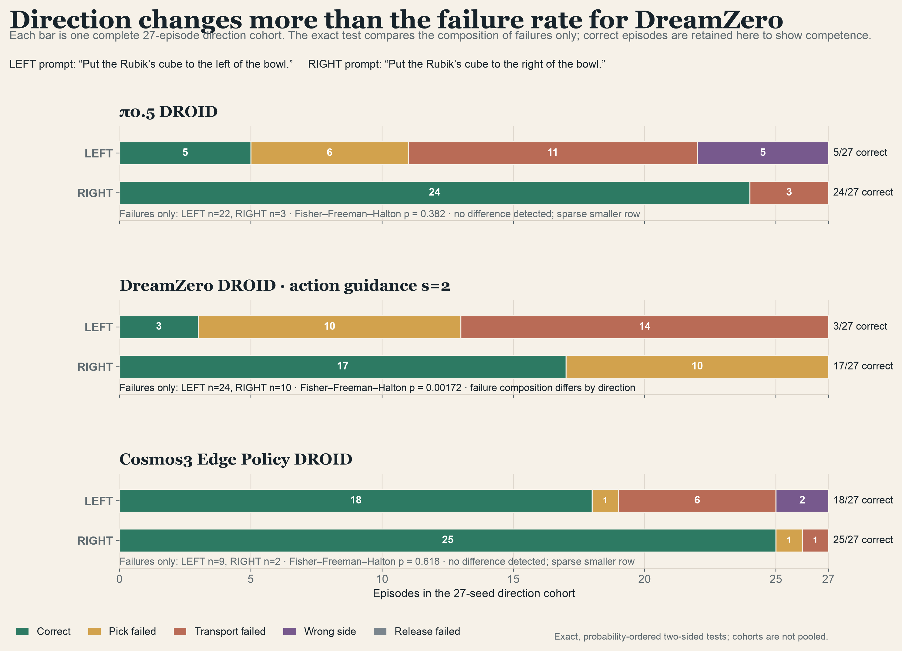
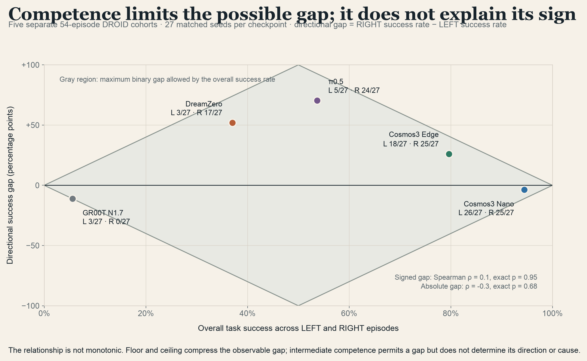
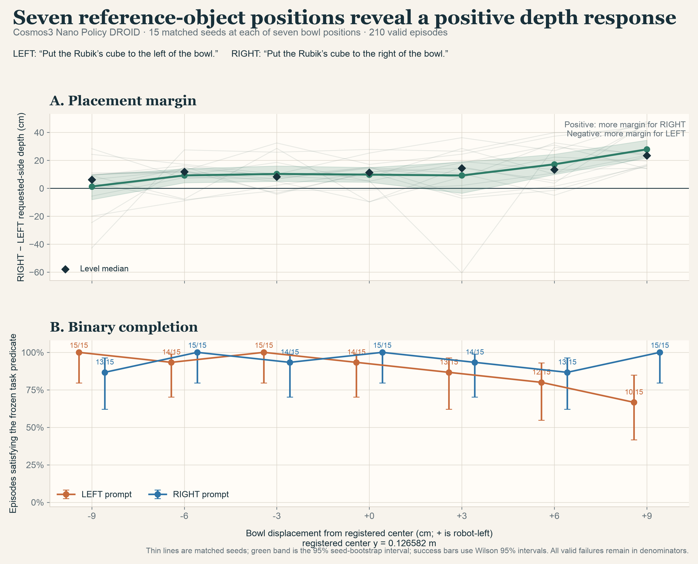
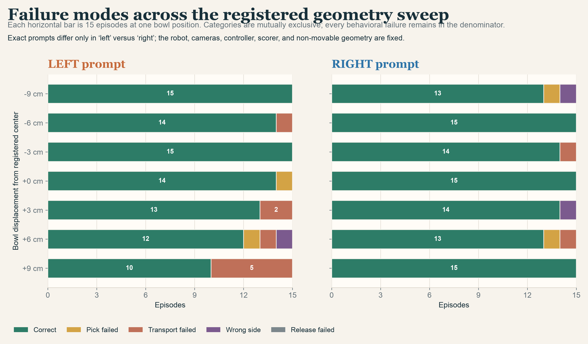

# VLA/WAM v3 expansion continuation

Updated: 7 August 2026, after the complete Phase-A launch-authorized queue, the
separately authorized π0-FAST compatibility bridge, the cross-version
measurement-coverage audit, and the completed 27-seed Nano V3-B001
position-reflection ablation were compiled. The separately preregistered π0.5
V3-B002 scene-matched replication is also complete and hash-closed at 108/108
valid episodes; its existing-log failure-mode split is complete. The
five-checkpoint gap-versus-competence diagnostic is also complete and adds no
new model inference. Phase C is complete for GR00T N1.7, Cosmos3 Edge, and
Cosmos3 Nano Policy DROID: all three independently released cohorts are
hash-closed at 160/160 valid episodes, for 480/480 total prospectively
registered Phase-C cells. π0.5 V3-D001 is complete and hash-closed at 432/432
valid stochastic episodes and 216/216 matched LEFT/RIGHT policy-sampling pairs.
The
machine-readable source of truth is
[`continuation_state.json`](../artifacts/vla_wam_shared_v3/continuation_state.json).

## Canonical sharing artifact

The figure-led [scientific report](../output/pdf/language_sensitivity_geometry_scientific_report.pdf)
is the compact reader-facing synthesis. Its 12 pages place each plot beside its
scientific interpretation, reproduce the frozen prompts, separate DROID/RoboLab
from RoboTwin, include the complete 11-checkpoint table, and distinguish
redirection, failure composition, and task completion. The report refuses to
build unless every completed cohort and required evidence manifest is present
and hash-consistent.

| Sharing artifact | SHA-256 |
| --- | --- |
| [`language_sensitivity_geometry_scientific_report.pdf`](../output/pdf/language_sensitivity_geometry_scientific_report.pdf) | `4343fb136b086fc8e84feb28713393161b65013f60aced6cae81f4a803670a70` |
| [`language_sensitivity_geometry_scientific_report.manifest.json`](../output/pdf/language_sensitivity_geometry_scientific_report.manifest.json) | `6978813f28c11ae807114e8051f138e73d06870ac96b99e72e9656616298b3a6` |

## Status

All **648 cells marked `authorized_new`** in the frozen Phase-A queue are
complete valid evidence: 270 DROID/RoboLab episodes and 378 RoboTwin episodes.
The queue's 40 `blocked_pi0` rows remain frozen under their unavailable exact
historical runtime identity. Amendment V3-A002 instead authorized a distinct,
publicly reproducible π0-FAST compatibility cohort: all **20 matched pairs / 40
episodes** are now complete valid evidence. That cohort is never pooled with
the blocked rows or preserved V2 evidence.

No Phase-A, V3-A002, Nano V3-B001, or π0.5 V3-B002 inference remains. Each
Phase-B reflection ablation is complete at **27 matched seeds / 108 valid
behavioral episodes** under its own hash-bound runtime identity. Both releases
followed model-blind physical gates before behavioral inference; π0.5 also
passed fixed-observation exact-repeat and LEFT/RIGHT prompt-sensitivity gates.
Every other Phase-B ablation remains unreleased. No Phase-C inference remains.
Other Phase-D checkpoints remain unreleased unless their exact runtime passes
an independent effective-stochastic-seed gate.

### Measurement-coverage gate for Phase B

The committed [measurement audit](../artifacts/vla_wam_shared_v3/measurement_coverage_audit.json)
checks all **982 unique behavioral episodes** across V1, V2, Phase A, and
V3-A002. Requested-side margin and signed final lateral offset are available
for **982/982** episodes, including failures; no value is imputed from binary
success. Older aliases are either explicit or algebraically exact. In
particular, older RoboTwin object-minus-target `x` is standardized as `-x`, so
positive remains robot LEFT, and its arena is still never pooled with DROID.
No legacy behavioral rerun is required for these two measurements.

The same audit reproduces Nano's 27-pair Phase-A margin gap: mean RIGHT-minus-
LEFT requested margin `0.123601 m`, with 23 positive and 4 negative paired
gaps and an exact two-sided sign-test `p = 0.0003107`. GR00T is already complete
at 27 matched pairs / 54 episodes and must not be rerun. Phase B must log both
fields for every new valid episode: signed offset supplies the full-sample
analysis, while any success-conditional margin analysis must name its reduced
subset explicitly.

### Nano Phase-B position-reflection release (V3-B001)

V3-B001 asks whether Nano's directional bias changes when the center positions
of the movable objects are reflected about the robot sagittal plane. It is a
**positions-only movable-object intervention, not a full-scene mirror**: the
robot, cameras, and nonmovable geometry remain fixed. Initial quaternion sources
are identical across layouts; any measured post-settle orientation difference
is retained as a downstream physical mediator rather than described as fixed.

The frozen queue contains **27 prespecified seeds, 9400–9426, × four cells per
seed = 108 cells**: `control` and `position_mirrored`, each under the exact
static prompts:

> Put the Rubik's cube to the left of the bowl.

> Put the Rubik's cube to the right of the bowl.

At release, calibration recorded **zero model requests and zero behavioral
episodes**. The primary analysis uses signed final lateral offset for the full
sample, including every valid behavioral failure. Requested-side margin is
secondary and success-conditional: it may be analyzed only on the named
`nano_v3b001_all_four_cells_correct` complete-case subset, containing seeds for
which control LEFT, control RIGHT, position-mirrored LEFT, and
position-mirrored RIGHT all pass the frozen success predicate. Missing values
are never imputed and unmatched successful cells are never mixed.

| Nano release/runtime artifact | SHA-256 |
| --- | --- |
| [`model_blind_calibration_report.json`](../artifacts/vla_wam_shared_v3/phase_b/nano_mirror_v3b001/model_blind_calibration_report.json) | `112716acada89050561c9488d93a333a300b1675c2305329c8e5aceeb4e6da71` |
| [`nano_mirror_v3b001_cells.jsonl`](../artifacts/vla_wam_shared_v3/phase_b/nano_mirror_v3b001/nano_mirror_v3b001_cells.jsonl) | `018b8b6ae76ac46f2f89eef83c4b16d7a4ff3d1ff15d91527b96fb56b5432c5a` |
| [`nano_mirror_v3b001_manifest.json`](../artifacts/vla_wam_shared_v3/phase_b/nano_mirror_v3b001/nano_mirror_v3b001_manifest.json) | `5c82268739feb41281435a51dcd848b575218cd9fbe5839d9ad130d1a7888830` |
| [`post_result_nano_mirror_v3b001_amendment.json`](../artifacts/vla_wam_shared_v3/phase_b/nano_mirror_v3b001/post_result_nano_mirror_v3b001_amendment.json) | `9d88c29733fa3b24a154977bc25d04d2d77df5be59e3213f0c3a6cfbe3edc6a0` |
| [`live_reset_semantics_correction.json`](../artifacts/vla_wam_shared_v3/phase_b/nano_mirror_v3b001/live_reset_semantics_correction.json) | `167494ff48b075c41ff64fce4c18c78ae6650d1bcfd63d0646cf386a0a82875b` |
| [`live_reset_preflight_report.json`](../artifacts/vla_wam_shared_v3/phase_b/nano_mirror_v3b001/live_reset_preflight_report.json) | `075a3d78fff99a74bfbb3981e77c20b6de20a9d5123e5ed4f6dea10ee2f61bc9` |
| [`live_queue_snapshot.json`](../artifacts/vla_wam_shared_v3/phase_b/nano_mirror_v3b001/live_queue_snapshot.json) | `bfd8f0e095fc83dd2d09ba254c0860d8c2d8bbdf02205173369c50e56013e52c` |
| [`live_infrastructure_ledger.json`](../artifacts/vla_wam_shared_v3/phase_b/nano_mirror_v3b001/live_infrastructure_ledger.json) | `33c83da878782f77aca60a95d0c7382982af33b2210403d96c17637d41cc0418` |
| [`nano_v3b001_results_manifest.json`](../artifacts/vla_wam_shared_v3/phase_b/nano_mirror_v3b001/results/nano_v3b001_results_manifest.json) | `ab9b9849e04bc15e65ed9d8d55d13e8aad62dbef5f5e2fa16b8eaf486a6ea517` |
| [`nano_v3b001_summary.json`](../artifacts/vla_wam_shared_v3/phase_b/nano_mirror_v3b001/results/nano_v3b001_summary.json) | `f43636a03caade5f3dc65de6736808c8257c78eacb07ba4cb963bfc6a0e36578` |
| [`nano_v3b001_final_evidence_manifest.json`](../artifacts/vla_wam_shared_v3/phase_b/nano_mirror_v3b001/results/nano_v3b001_final_evidence_manifest.json) | `ed16c120f58b89fe67227c544a7ac7b20610e802a0a19276fcb0f7796cef5270` |
| [`nano_v3b001_publication_media_manifest.json`](../artifacts/vla_wam_shared_v3/phase_b/nano_mirror_v3b001/results/publication_media/nano_v3b001_publication_media_manifest.json) | `2a9023b976b6a877b2da266ce1333f6639d89a971a4e082f50a7af1f0cf246ea` |

The release files authorize the exact queue under the verified runtime identity.
The two `live_*` evidence files remain immutable historical records of the
12-cell prefix. Completed-result analysis must use the final results manifest,
summary, aggregate JSONL, and hash-closed evidence manifest.

### Nano V3-B001 completed result

V3-B001 completed all **108/108 prespecified cells**: 27 matched seeds, two
layouts, and the exact LEFT/RIGHT prompt pair. All 108 valid behavioral
episodes—including every model failure—enter the denominator. The outcome
taxonomy is 102 `correct`, five `transport_failed`, one `release_failed`, and
zero `pick_failed` or `wrong_side`. Condition-level success is:

| Layout | LEFT | RIGHT |
| --- | ---: | ---: |
| Control | 26/27 | 26/27 |
| Position-reflected | 27/27 | 23/27 |

The full-sample primary estimands use signed final lateral offset for every
seed, including failures. Changing the prompt redirected endpoints in the
requested LEFT-to-RIGHT order for **27/27 control seeds** and **27/27
position-reflected seeds**. Median separation was `+46.7 cm` in control and
`+43.7 cm` after position reflection. Their prespecified interaction was small:
median `+0.7 cm`, mean `+0.5 cm` with paired-bootstrap 95% CI `[-5.6, +6.6] cm`,
and exact two-sided sign-test `p = 0.701`.

The requested-side depth contrast changed sharply. In control, RIGHT finished
deeper in its requested side than LEFT by median `+14.8 cm`; after reflecting
movable-object center positions, that contrast reversed to median `-8.8 cm`.
The prespecified reflection interaction was median **`-24.6 cm`** and mean
`-24.8 cm` with paired-bootstrap 95% CI `[-32.4, -17.3] cm`; **24/27** seeds
were negative and the exact two-sided sign-test was **`p = 4.923e-05`**.

The success-conditional secondary analysis contains only the named 21-seed
all-four-cells-correct subset. It does not encode failures as zero or combine
unmatched successful cells. Its requested-margin interaction was median
`-22.8 cm`, mean `-21.2 cm` with 95% CI `[-29.1, -13.5] cm`, 18/21 negative,
and exact sign-test `p = 0.00149`.

The supported inference is precise: under this checkpoint and simulator, the
static language probe robustly redirected endpoints in either layout, while the
registered movable-object position reflection changed which requested direction
received greater side depth. This establishes a causal effect of that physical
intervention on the measured contrast. It does **not** identify training data as
the mechanism, isolate reachability from downstream physical mediators, or test
a full-scene mirror, base rotation, start-side interaction, or role swap.

The compiler retained 738 decoded local predictions across 21,972 executed
actions. The bounded publication clips show the complete actual rollout beside
every exposed 33-frame request-local prediction in order; the stitched right
panel is not a continuous full-task imagination and does not receive a success
score.

#### Historical live-boundary and reset audit

The committed live snapshot freezes the first three complete four-cell seed
blocks (9400–9402): 12 valid behavioral cells, 10 `correct`, one
`release_failed`, and one `transport_failed`. It is retained as a historical
prefix, not current study state. Four earlier complete behavioral attempts were
invalidated before analysis, and all 39 prior model-sampler requests remain
infrastructure evidence in the hash-bearing
[`live_infrastructure_ledger.json`](../artifacts/vla_wam_shared_v3/phase_b/nano_mirror_v3b001/live_infrastructure_ledger.json).

Attempt 10 used all four wrappers in calibration order, yet its control-LEFT
reset failed the frozen 3 mm gate before any model request. Registration context
is therefore falsified as the sufficient explanation. The confirmed defect is
the interaction between RoboLab's episode-length mutation order and the live
proxy. The pinned runner calls `env.reset()` twice. After call 1, the
pre-correction proxy zeroed `episode_length_buf`; call 2 then saw `ep_len=0`,
entered RoboLab's `artifact_ids` branch, and performed a fresh second physical
reset. Ordinal-1 live calibration evidence had validated the analytic frozen
fixture coordinates; the pre-correction gate instead attested ordinal 2 and
observed the `0.0034789443 m` error.

Calibration repeat semantics are now disclosed precisely. Repeat 0 was one
fresh physical reset followed by 60 settle and 15 stability steps. Repeats 1
and 2 saw `ep_len=75`; RoboLab marked them frozen before computing active IDs,
so they did not perform fresh physical resets. Their near-identical states are
valid model-blind stability observations, but not three independent resets.

The prospective operational correction is frozen in
[`live_reset_semantics_correction.json`](../artifacts/vla_wam_shared_v3/phase_b/nano_mirror_v3b001/live_reset_semantics_correction.json).
The exact bridge must receive two runner reset calls but perform one physical
reset and one settle gate. Call 1 evidence is provisional and not persisted.
The immediate call 2 is idempotent, returns cached observation/info, keeps the
frozen flags false, and persists the final `2/1/1/true` attestation. That
attestation must bind `[75] → [0]` and zero model requests. Prompts, seeds,
analytic fixture coordinates, the success predicate, 60+15 steps, and the 3 mm
tolerance are unchanged.

Attempts 08 and 09 remain excluded server failures: a nonwritable Triton home
(`247d772c…`) and NFS cleanup under a PVC-backed `TMPDIR` (`ff2159bf…`).
Persistent caches stay on the ali-owned PVC; server `TMPDIR` is pod-local, and
`OMNI_KIT_ACCEPT_EULA=YES` remains explicit. Attempt 10's first mirrored-RIGHT
cell compiled provisionally as a success after 169 actions. Its raw JSONL
(`a51380c9…`), video (`92e26891…`), and manifest (`bca5342c…`) are preserved but
invalidated because the runtime source changes. The zero-request control
failure retains fixture (`573f1df5…`), settle (`588297f9…`), and bridge
(`1f921e18…`) evidence.

The zero-sampling exact-bridge preflight has now passed under runtime-attempt-08
identity `2c5e314a…`, bound to clean pushed commit `39f19b57…`; the manifest file
hash is `a609300c…`. The bridge accepted a transport request packet on each
layout and received the explicit no-inference response. No model server or
checkpoint was loaded, no model sample was drawn, and no action was executed.

Both the first released layout
`v3b001:nano:seed9400:position_mirrored:right` and a control-LEFT diagnostic
invoked through the exact `cell_plan` + `run_cell` path passed the final
`2/1/1/true` reset attestation with `[75] → [0]`, zero requests during the gate,
matching positions, and a neutral reset relation. The maximum position errors
for mirrored RIGHT were `0.244`, `0.420`, and `0.609 mm` for banana, bowl, and
cube. Control LEFT measured `0.244`, `0.022`, and `2.758 mm`, respectively,
remaining within the frozen 3 mm tolerance. The control diagnostic did not
advance the frozen queue. Complete hashes are retained in
[`live_reset_preflight_report.json`](../artifacts/vla_wam_shared_v3/phase_b/nano_mirror_v3b001/live_reset_preflight_report.json).

The completed queue used only that verified runtime identity. The preflight's
mirrored-RIGHT cell became one of the 108 valid rows. Split ali-owned RTX pods
were an operational load-isolation choice, not a scientific factor.

Within the three complete blocks, condition-level requested success is 2/3 for
control LEFT, 2/3 for control RIGHT, 3/3 for position-mirrored LEFT, and 3/3 for
position-mirrored RIGHT. These remain descriptive historical-prefix counts and
must not replace the completed result above. Signed final lateral offset and
requested-side margin are retained for all 12 cells in
[`live_queue_snapshot.json`](../artifacts/vla_wam_shared_v3/phase_b/nano_mirror_v3b001/live_queue_snapshot.json).
The prefix's all-four-cells-correct margin subset contains only seed 9400
(`n=1`); no inference is made from that prefix.

### π0.5 position-reflection registration and completed result (V3-B002)

V3-B002 is the exact scene-matched π0.5 replication of the Nano design: the
same 27 seeds `9400–9426`, the same control and position-reflected fixtures,
and the same randomized four-cell execution order within every seed. The
frozen queue therefore contains **27 matched seeds × 4 cells = 108 episodes**.
No seed was resampled. Each seed keeps all four cells under one runtime lane.
The prompt bytes remain:

> Put the Rubik's cube to the left of the bowl.

> Put the Rubik's cube to the right of the bowl.

The registration records three predictions before π0.5 V3-B002 inference.
H1 predicts an endpoint-redirection interaction near zero, following Nano's
mean `+0.5 cm` result (`p = 0.701`). H2 predicts a strongly negative
requested-side-depth interaction, following Nano's mean `-24.8 cm` result
(`p = 4.923e-05`). H3 is a two-sided exact test of whether reflection changes
π0.5's prior binary RIGHT-over-LEFT gap (`24/27` versus `5/27`); its direction
was deliberately not filled in after registration. Continuous interactions use
20,000 matched-seed bootstrap resamples with master seed `3104159`, medians,
and exact sign tests. H3 reports the per-seed difference-in-differences on
`{-2,-1,0,1,2}`, its exact within-seed permutation test, and the 2×2 success
table.

V3-B002 subsequently completed all **108/108 prespecified cells** under one
hash-bound runtime identity. Every valid behavioral failure remains in the
denominator. Eighteen infrastructure attempts are retained in a separate
stream and excluded from behavioral statistics. The outcome taxonomy over the
108 valid episodes is 63 `correct`, 14 `pick_failed`, 27 `transport_failed`,
three `wrong_side`, and one `release_failed`.

The observed 2×2 success table shows that the large binary asymmetry reversed
under the registered position reflection:

| Layout | LEFT | RIGHT |
| --- | ---: | ---: |
| Control | 4/27 | 25/27 |
| Position-reflected | 25/27 | 9/27 |

For H3, the per-seed success difference-in-differences distribution was
`{-2: 12, -1: 13, 0: 2, +1: 0, +2: 0}`. The mean DiD was `-1.3704` and the
exact two-sided within-seed layout-label permutation test gave
**`p = 5.960e-08`**.

The continuous estimands separate endpoint redirection from requested-side
depth. Values below are means in meters with matched-seed bootstrap 95%
intervals; sign tests are exact and two-sided.

| Estimand | Control | Position-reflected | Reflected − control interaction |
| --- | --- | --- | --- |
| H1 endpoint redirection | `+0.1923` [`+0.1389`, `+0.2462`], median `+0.1993`, 25+/2−, `p=5.648e-06` | `+0.1811` [`+0.1424`, `+0.2163`], median `+0.1847`, 26+/1−, `p=4.172e-07` | `-0.0112` [`-0.0781`, `+0.0568`], median `-0.0367`, 12+/15−, **`p=0.7011`** |
| H2 requested-side depth | `+0.2075` [`+0.1631`, `+0.2539`], median `+0.1694`, 26+/1−, `p=4.172e-07` | `-0.1384` [`-0.1788`, `-0.0958`], median `-0.1501`, 3+/24−, `p=4.923e-05` | `-0.3459` [`-0.4138`, `-0.2846`], median `-0.3503`, 0+/27−, **`p=1.490e-08`** |

Thus H1 replicated: position reflection did not measurably change the magnitude
of prompt-conditioned endpoint redirection. H2 also replicated and was larger
for π0.5: requested-side depth reversed across all 27 seed-level interactions.
H3 provides the new result: binary success changed from a strong RIGHT advantage
in control to a strong LEFT advantage after reflection. Together these results
support geometry or layout as a major confound in π0.5's directional competence
under this simulator setup. They do not imply that all language-conditioned
steering is geometric, isolate reachability from downstream physical mediators,
or identify training distribution as the mechanism.

The independent existing-log failure-mode split is already complete and adds
no new inference. Counts below are `correct / pick / transport / wrong-side /
release`:

| Checkpoint | LEFT counts | RIGHT counts | Failure-only exact p |
| --- | ---: | ---: | ---: |
| π0.5 | 5 / 6 / 11 / 5 / 0 | 24 / 0 / 3 / 0 / 0 | 0.3822 |
| DreamZero | 3 / 10 / 14 / 0 / 0 | 17 / 10 / 0 / 0 / 0 | 0.001722 |
| Cosmos3 Edge | 18 / 1 / 6 / 2 / 0 | 25 / 1 / 1 / 0 / 0 | 0.6182 |

DreamZero's failure-only distribution differs by requested direction in this
cohort. π0.5 and Edge do not reject a shared failure shape, but their RIGHT
failure rows contain only three and two episodes; this is not evidence of
equivalence. Raw 162-row JSONL, row-normalized proportions, exact-test
enumeration, and all source/output hashes are retained under the V3-B002
analysis directory.

| V3-B002 registration, gate, and result artifact | SHA-256 |
| --- | --- |
| [`post_result_pi05_mirror_v3b002_amendment.json`](../artifacts/vla_wam_shared_v3/phase_b/pi05_mirror_v3b002/post_result_pi05_mirror_v3b002_amendment.json) | `8e56365fdc306adbef2d2f2f8357653d1a683ff17f879f624d7eefd4acb1abb6` |
| [`pi05_mirror_v3b002_cells.jsonl`](../artifacts/vla_wam_shared_v3/phase_b/pi05_mirror_v3b002/pi05_mirror_v3b002_cells.jsonl) | `0db680a3aee04c991bcc78904cb572b7d962971e04fbc879e828354da30dafee` |
| [`pi05_mirror_v3b002_manifest.json`](../artifacts/vla_wam_shared_v3/phase_b/pi05_mirror_v3b002/pi05_mirror_v3b002_manifest.json) | `8aaaa38302f6a654090250b3e12cd8735fab28a74027d50193325ffa9d0dddea` |
| [`failure_mode_split_episodes.jsonl`](../artifacts/vla_wam_shared_v3/phase_b/pi05_mirror_v3b002/analysis/failure_mode_split_episodes.jsonl) | `94d078c16d579019c216a7d05c0e4748d049d4bc91ab1879ca38b8bc78da8735` |
| [`failure_mode_split_report.json`](../artifacts/vla_wam_shared_v3/phase_b/pi05_mirror_v3b002/analysis/failure_mode_split_report.json) | `f6289333d77538ed9235a567cb98d70333dd50549f7e52d13bfe5d34a10bdf96` |
| [`failure_mode_split_manifest.json`](../artifacts/vla_wam_shared_v3/phase_b/pi05_mirror_v3b002/analysis/failure_mode_split_manifest.json) | `5a0e95af238536dbbcf7a6c81bf721f095cea1a5e178ddfbaecda8105a1e06ab` |
| [`gate_manifest.json`](../artifacts/vla_wam_shared_v3/phase_b/pi05_mirror_v3b002/gates/gate_manifest.json) | `bf050c7301d3fbc621bb13ca271c1280839bb1a9e83c214b4f7f7da597d3dd1d` |
| [`runtime_identity.json`](../artifacts/vla_wam_shared_v3/phase_b/pi05_mirror_v3b002/gates/runtime_identity.json) | `928af903ff99b02dd753b21eca2f6243142aced320a31166645bb1a0427a0f89` |
| [`release_gate.json`](../artifacts/vla_wam_shared_v3/phase_b/pi05_mirror_v3b002/gates/release_gate.json) | `450fcac935b4ff570d53f7d2c844ee10e9c4f2bba8f151692a49fd6de25bc07e` |
| [`fixed_observation_gate.json`](../artifacts/vla_wam_shared_v3/phase_b/pi05_mirror_v3b002/gates/fixed_observation_gate.json) | `baf8e9744bb3baa03748521dd72aed88283cbccb613ad0805c6ecbf89e7cdf06` |
| [`pi05_v3b002_episodes.jsonl`](../artifacts/vla_wam_shared_v3/phase_b/pi05_mirror_v3b002/results/pi05_v3b002_episodes.jsonl) | `7b89287a2b75e40cffc97cd6d2fea58c4189a09d2dc5a0fb9a6427df3d726e70` |
| [`pi05_v3b002_pairs.jsonl`](../artifacts/vla_wam_shared_v3/phase_b/pi05_mirror_v3b002/results/pi05_v3b002_pairs.jsonl) | `5812383a6ca7beddd95e69c7ded380b605c34a2f56d6ecbf887365a9720d6447` |
| [`pi05_v3b002_infrastructure_attempts.jsonl`](../artifacts/vla_wam_shared_v3/phase_b/pi05_mirror_v3b002/results/pi05_v3b002_infrastructure_attempts.jsonl) | `0159426cf6456a440e79419c6fde857d76fb35bd7ad8d38a6a9891de838f5da8` |
| [`pi05_v3b002_report.json`](../artifacts/vla_wam_shared_v3/phase_b/pi05_mirror_v3b002/results/pi05_v3b002_report.json) | `32ffa99f720906abe8679b0791be3f12d3c91dfce0274d85457a6d2ba59d2b71` |
| [`pi05_v3b002_output_manifest.json`](../artifacts/vla_wam_shared_v3/phase_b/pi05_mirror_v3b002/results/pi05_v3b002_output_manifest.json) | `523a6a2625dc0b67c1f425220006bdca6edea32e554f826f2b6f616c57393090` |

The runtime's internal identity is
`6e5e500f5efee2d7576d090a8ec544f28e47af4db6e797c1bb514a16a43fc944`.
The model-blind fixture/reset/renderer/writer checks passed on all six lanes
with zero model requests and zero behavioral episodes; the fixed-observation
gate passed exact LEFT repeat and measured LEFT/RIGHT action RMS `0.00361754`.
These gates preceded behavioral release. V3-B002 is now complete, hash-closed,
and must not be rerun.

Authoritative implementation and verification paths are
`experiments/v3/pi05_phase_b/{contract,runtime,robolab_bridge,queue,compiler}.py`,
`tools/normalize_pi05_v3b002_infrastructure.py`,
`tests/test_pi05_v3b002_runtime.py`,
`tests/test_pi05_v3b002_compiler.py`, and
`tests/test_normalize_pi05_v3b002_infrastructure.py`.

## Retrospective mechanism diagnostics (A1 and B1)

The two zero-compute diagnostics requested before another Phase-B release are
complete. They do not support a universal “same failure process at a different
rate” explanation.

The failure-mode split retains every episode in a direction × frozen-outcome
table, then applies a probability-ordered two-sided Fisher–Freeman–Halton test
to failures only. DreamZero's failure composition differs by requested
direction (`p = 0.001722`): LEFT failures are 10 pick and 14 transport failures,
whereas all 10 RIGHT failures are pick failures. π0.5 (`p = 0.3822`) and Cosmos3
Edge (`p = 0.6182`) do not show a detected difference, but their smaller failure
rows contain only three and two episodes. Those nulls do not establish equal
failure shapes.



Across the five 54-episode DROID cohorts, overall success is not monotonically
associated with the signed directional gap (Spearman `rho = 0.1`, exact
permutation `p = 0.95`) or its magnitude (`rho = -0.3`, `p = 0.6833`). Binary
competence instead imposes a mechanical envelope: at overall success `c`, the
largest possible absolute LEFT/RIGHT gap is `2 min(c, 1-c)`. GR00T near floor
and Nano near ceiling therefore cannot exhibit a large binary gap; intermediate
competence permits one but does not determine its sign or cause.



The complete machine-readable analysis is
[`gap_vs_competence_report.json`](../artifacts/vla_wam_shared_v3/analysis/mechanism/gap_vs_competence_report.json),
and the figure hashes and claim boundaries are in
[`mechanism_figure_manifest.json`](../artifacts/vla_wam_shared_v3/analysis/mechanism/figures/mechanism_figure_manifest.json).
The resulting decision is to retain DreamZero as the third position-reflection
checkpoint and the lateral-position dose-response as the next mechanism tests.
Neither is released until its independent model-blind registration and runtime
gates are committed.

### DreamZero third position reflection registered (V3-B003)

V3-B003 is now hash-bound before inference for the exact DreamZero V2-A015
action-guidance `s=2` identity. It reuses the complete V3-B001 scene, seeds
`9400–9426`, four conditions per seed, exact prompt bytes, fixtures, and
within-seed execution order: **27 matched seeds × 4 = 108 registered cells**.
The registered seed labels remain 9400–9426, while the released DreamZero
model-noise seed is explicitly constant at `1140`. This limitation is disclosed
rather than represented as stochastic replication.

Known before registration were DreamZero Phase-A success (LEFT 3/27, RIGHT
17/27), its direction-dependent failure composition (`p = 0.001722`), and the
completed Nano and π0.5 position-reflection results. The registered prediction
is that reflection produces a negative requested-side-depth interaction and
attenuates or reverses DreamZero's prior RIGHT advantage; the primary exact
tests remain two-sided.

| V3-B003 registration artifact | SHA-256 |
| --- | --- |
| [`post_result_dreamzero_mirror_v3b003_amendment.json`](../artifacts/vla_wam_shared_v3/phase_b/dreamzero_mirror_v3b003/post_result_dreamzero_mirror_v3b003_amendment.json) | `ba22681ae4d7f748e375617617d9e130e6f1bd5bc0af1e7a995365b145a470fc` |
| [`dreamzero_mirror_v3b003_cells.jsonl`](../artifacts/vla_wam_shared_v3/phase_b/dreamzero_mirror_v3b003/dreamzero_mirror_v3b003_cells.jsonl) | `a6d0f0a5d4c7cdfa5d3de95d44d7b11f42750a76a603ff8c2e44848e34b8f70d` |
| [`dreamzero_mirror_v3b003_manifest.json`](../artifacts/vla_wam_shared_v3/phase_b/dreamzero_mirror_v3b003/dreamzero_mirror_v3b003_manifest.json) | `efe50df701193e48b981c025ea3b4d27a80e3bdf83216e38a98a63e27061cb23` |

The independent release gate has now passed. Four distinct ali RTX lanes each
passed all 12 condition-by-reset attestations in fresh Isaac processes (48/48
total), with zero model requests and zero behavioral episodes. The fresh
DreamZero `s=2` server also produced bit-identical repeat actions and latents,
while LEFT versus RIGHT differed (action RMS `0.02782`; latent RMS `0.16755`),
and retained the official reset decode. The hash-bound
[`release gate`](../artifacts/vla_wam_shared_v3/phase_b/dreamzero_mirror_v3b003/gates/release_gate.json)
has SHA-256 `7e30e618ee233ea04675d556f48621f6ff7de84f4ac9033460d0d9531a234dd6`.
All 108 registered cells are authorized; none was complete at this checkpoint.

### DreamZero third position reflection complete (V3-B003)

The prespecified cohort is now complete: **108/108 valid behavioral episodes**
(27 seeds × two layouts × two exact directions), with every behavioral failure
retained and infrastructure attempts excluded. The exact prompts remained
“Put the Rubik's cube to the left of the bowl.” and “Put the Rubik's cube to
the right of the bowl.”

| Layout | LEFT success | RIGHT success |
| --- | ---: | ---: |
| Control | 5/27 | 8/27 |
| Positions reflected | 25/27 | 25/27 |

Reflection substantially improved completion for both directions, from 13/54
in control to 50/54 after reflection. It also changed the continuous
requested-side-depth contrast: the reflected-minus-control interaction was
`-0.1409 m` (95% matched-seed bootstrap CI `[-0.1992, -0.0819]`; 23/27
negative; exact sign-test `p = 0.000311`). The binary directional-success gap,
however, did **not** significantly reverse: per-seed DiD mean `-0.111`, with
8 negative, 14 zero, and 5 positive seeds (exact within-seed permutation
`p = 0.581`). This supports a large layout-dependent competence effect for
DreamZero without evidence, in this cohort, that reflection reverses its
binary LEFT-versus-RIGHT success gap.

Matched endpoint redirection remained prompt-sensitive in both layouts and
increased after reflection: mean RIGHT-minus-LEFT endpoint shift was
`+0.1217 m` in control and `+0.3764 m` after reflection; their interaction was
`+0.2547 m` (95% CI `[+0.2020, +0.3071]`; 26/27 positive; exact sign-test
`p = 4.17e-7`). All 54 matched pairs had distinct executed actions. The final
failure taxonomy is 63 correct, 26 pick failures, 17 transport failures, one
wrong-side failure, and one release failure.

One retained episode was initially packaged as `release_failed` by the bridge
although its raw steps showed verified pickup, only transient requested-cone
entry, and neither final sustained cone occupancy. Frozen taxonomy precedence
therefore derives `transport_failed`. The original remains preserved; a
deterministic hash-bound packaging copy was produced with **zero inference,
zero executed actions, and no behavioral rerun**. The before/after hashes are
in the committed
[`repair report`](../artifacts/vla_wam_shared_v3/phase_b/dreamzero_mirror_v3b003/results/retained_taxonomy_packaging_repair/repair_report.json).

The compact result set is the
[`summary`](../artifacts/vla_wam_shared_v3/phase_b/dreamzero_mirror_v3b003/results/dreamzero_v3b003_summary.json),
[`episode JSONL`](../artifacts/vla_wam_shared_v3/phase_b/dreamzero_mirror_v3b003/results/dreamzero_v3b003_episodes.jsonl),
[`matched-pair JSONL`](../artifacts/vla_wam_shared_v3/phase_b/dreamzero_mirror_v3b003/results/dreamzero_v3b003_matched_pairs.jsonl),
and [`evidence manifest`](../artifacts/vla_wam_shared_v3/phase_b/dreamzero_mirror_v3b003/results/evidence_manifest.json).

### Cosmos3 Nano target start-side interaction complete (V3-B008)

The start-side cohort is complete at **162/162 valid episodes**: 27 matched
seeds, three frozen initial target positions, and both exact directions.
Behavioral failures remain in the denominator; the retained cold-server
timeout is infrastructure-only and is excluded. All 81 matched LEFT/RIGHT
action traces differed.

| Initial Rubik's-cube position | Exact LEFT prompt | Exact RIGHT prompt | LEFT | RIGHT |
| --- | --- | --- | ---: | ---: |
| Robot-left of the bowl | “Put the Rubik's cube to the left of the bowl.” | “Put the Rubik's cube to the right of the bowl.” | 26/27 | 22/27 |
| Laterally aligned with the bowl | “Put the Rubik's cube to the left of the bowl.” | “Put the Rubik's cube to the right of the bowl.” | 26/27 | 26/27 |
| Robot-right of the bowl | “Put the Rubik's cube to the left of the bowl.” | “Put the Rubik's cube to the right of the bowl.” | 23/27 | 27/27 |

The requested-direction success gap changed by `+0.296` per matched seed
between the two outer start positions (target-start-right minus
target-start-left; exact within-seed permutation `p = 0.0156`). The same
outer-level interaction was `+0.0732 m` for endpoint redirection (95%
matched-seed bootstrap CI `[+0.0025, +0.1512]`) and `+0.0789 m` for
requested-side depth (95% CI `[+0.0124, +0.1470]`).

Thus the initial target side measurably changes Nano's apparent directional
competence. This supports a geometry, reachability, or policy-state account
for part of the observed direction gap; it does not identify training data or
remove the separate evidence that the action trace responds to the exact
prompt. The compact [`summary`](../artifacts/vla_wam_shared_v3/prospective_tier_b/results/v3b008/v3b008_summary.json),
[`episodes`](../artifacts/vla_wam_shared_v3/prospective_tier_b/results/v3b008/v3b008_episodes.jsonl),
[`pairs`](../artifacts/vla_wam_shared_v3/prospective_tier_b/results/v3b008/v3b008_matched_pairs.jsonl),
and [`evidence manifest`](../artifacts/vla_wam_shared_v3/prospective_tier_b/results/v3b008/evidence_manifest.json)
are hash-closed. Do not rerun a valid V3-B008 cell.

### Cosmos3 Nano target/reference role swap complete (V3-B009)

The role-swap cohort is complete at **108/108 valid episodes**: 27 matched
seeds, two target/reference assignments, and both exact directions. Behavioral
failures remain in the denominator; no infrastructure attempt is included.
All 54 matched LEFT/RIGHT action traces differed.

| Target and reference | Exact LEFT prompt | Exact RIGHT prompt | LEFT | RIGHT |
| --- | --- | --- | ---: | ---: |
| Cube target, bowl reference | “Put the Rubik's cube to the left of the bowl.” | “Put the Rubik's cube to the right of the bowl.” | 24/27 | 24/27 |
| Bowl target, cube reference | “Put the bowl to the left of the Rubik's cube.” | “Put the bowl to the right of the Rubik's cube.” | 19/27 | 27/27 |

Changing which object was manipulated significantly altered the continuous
direction contrasts. Bowl-target minus cube-target endpoint redirection was
`+0.1360 m` (95% matched-seed bootstrap CI `[+0.0687, +0.2052]`; 22/27
positive; exact sign-test `p = 0.00151`). The corresponding requested-side
depth interaction was `+0.1302 m` (95% CI `[+0.0563, +0.2057]`; 22/27
positive; `p = 0.00151`). The binary success interaction was `+0.296` per seed
but did not cross the prespecified 0.05 threshold (`p = 0.0557`).

This is evidence that target/reference assignment modulates Nano's physical
response to the direction probe. It does not isolate language: swapping roles
also changes object semantics, geometry, grasp affordance, and transport
dynamics. The compact [`summary`](../artifacts/vla_wam_shared_v3/prospective_tier_b/results/v3b009/v3b009_summary.json),
[`episodes`](../artifacts/vla_wam_shared_v3/prospective_tier_b/results/v3b009/v3b009_episodes.jsonl),
[`pairs`](../artifacts/vla_wam_shared_v3/prospective_tier_b/results/v3b009/v3b009_matched_pairs.jsonl),
and [`evidence manifest`](../artifacts/vla_wam_shared_v3/prospective_tier_b/results/v3b009/evidence_manifest.json)
are hash-closed. Do not rerun a valid V3-B009 cell.

### Nano lateral-position dose response: V3-B004 failed closed; V3-B005 complete

The original V3-B004 physical gate found a decisive model-blind geometry
failure before any inference. At the registered `-30 mm` bowl level, the
original fixed banana left only `0.001851 m` of projected separation, below
the frozen `0.002 m` minimum. Every permitted symmetric half-range
`r >= 90 mm` contains that level or a more negative one. V3-B004 is therefore
permanently unreleased: **zero model requests, zero behavioral episodes, and
no behavioral denominator effect**. The raw physical rows remain on the PVC;
their hashes and the exact termination reason are recorded in the
[`V3-B004 failure report`](../artifacts/vla_wam_shared_v3/phase_b/nano_lateral_sweep_v3b004/model_blind_calibration_failure_report.json).

V3-B005 is a new prospective cohort, not a relaxed V3-B004. It moves only the
irrelevant banana distractor by `-0.200 m` in robot-frame `y`, then freezes it.
The Rubik's cube, bowl center, prompts, scorer, controller, cameras, robot, and
all nonmovable geometry retain their registered values. The seven bowl levels
are now fixed before the gate at center `0.12658219039440155 m` plus
`[-90, -60, -30, 0, +30, +60, +90] mm`.

The behavioral design remains **15 prespecified matched seeds (9500–9514) ×
seven bowl lateral positions × two exact directions = 210 cells**. The primary
estimand includes every valid episode: within each seed, regress the
requested-side depth contrast
`B[i,j] = (-s[i,j,RIGHT]) - s[i,j,LEFT]` on bowl position. Report all 15
slopes, their mean and median, a 20,000-resample seed bootstrap interval, sign
counts, an exact sign test, and an in-support zero crossing only. Binary
success is secondary because Nano is near ceiling.

Before any Nano model request, all **42 exact physical rows** (seven levels ×
three fresh resets × two relations) must pass the registered settle,
neutrality, collision, RTX-rendering, matched-fingerprint, and PVC-writer
checks. The 5 mm settle tolerance is disclosed in advance and reflects
zero-model physical reset variation observed during V3-B004. Any failed row
fails V3-B005 closed; the distractor, center, range, and spacing cannot be
changed after this registration.

Hash-bound preregistration:

| File | SHA-256 |
| --- | --- |
| [`V3-B005 amendment`](../artifacts/vla_wam_shared_v3/phase_b/nano_lateral_sweep_v3b005/post_result_nano_lateral_sweep_v3b005_amendment.json) | `ff23475b53791c42715938d51a303e0ab82de88b1b8a7a30758c008c9919a47b` |
| [`V3-B005 safe-distractor fixture`](../artifacts/vla_wam_shared_v3/phase_b/nano_lateral_sweep_v3b005/prospective_safe_distractor_fixture.json) | `87ff070be25b61538ead16ddbe06d2e9c155698ec2ea8acecbc30bd20b0197a5` |

The physical gate is now complete: **42/42 rows passed**, with all seven exact
positions accepted on both relation wrappers across three independent fresh
resets. No Nano model request or behavioral episode occurred. The compact
[`physical-gate report`](../artifacts/vla_wam_shared_v3/phase_b/nano_lateral_sweep_v3b005/model_blind_lateral_calibration_report.json)
has SHA-256 `60a065f24f76b0fe007a2455bf674dcde33204beb2f00dac1d930edd8f6542bf`.

The exact **210-cell queue** is now committed before model use. Seeds
9500–9513 use a cyclic Latin rotation over the fourteen level×relation cells;
seed 9514 uses the preregistered SHA-256 order. The
[`queue`](../artifacts/vla_wam_shared_v3/phase_b/nano_lateral_sweep_v3b005/nano_lateral_v3b005_cells.jsonl)
has SHA-256 `a770ae94274eaa85591a3ecd1f0f919b85dadc1c0ac3197c363b31659cb6b132`;
the [`manifest`](../artifacts/vla_wam_shared_v3/phase_b/nano_lateral_sweep_v3b005/nano_lateral_v3b005_manifest.json)
has SHA-256 `47c426f13146591d1a0bde60136e124eb5818cd8d44ef312f0f8fa82ad1623a1`.
The fresh Nano runtime and fixed-observation release gate passed before any
behavioral episode. The runtime identity is `2aa9a2dbefa2fd24596fd97e5ac9084ed0745201be4ec801f3899a9c2982c022`;
the [`behavioral release gate`](../artifacts/vla_wam_shared_v3/phase_b/nano_lateral_sweep_v3b005/gates/behavioral_release_gate.json)
has SHA-256 `4a1524b773db9b64a78e8cc81105d81ec2ece76755162d52501d6b9fe4a44b39`.
A live two-lane isolation audit then verified 55 concurrent cells and 366
requests with no response-attribution mismatch; its hash is
`11e907d9e45c9bab2a4744c04049180647c51faab59bb465fc6870df8d04cbcf`.

All **210/210 registered behavioral cells** are complete: 15 matched seeds ×
seven bowl positions × two exact directions, giving 105 matched pairs. The
final audit covers 1,423 model requests and 1,423 exposed local futures, all
210 simulator videos, 4,843 unique retained files (47.9 GB), and 41,467
decoded viewport frames. It found no hash mismatch, bridge failure,
infrastructure-invalid cell, partial cell, or missing registered cell. V3-B005
is therefore hash-closed and **must not be rerun**.

The primary registered quantity changed continuously with reference-object
position. The mean within-seed slope of requested-side depth contrast was
`1.125 m/m` (20,000-resample 95% bootstrap CI `0.719` to `1.562`; median
`1.209`; 13 positive, 2 negative; exact two-sided sign-test `p=0.00739`). The
estimated linear zero crossing was `0.0188 m`, outside the registered support
[`0.0366`, `0.2166`] m, so no in-support reversal is claimed. This supports a
geometry-linked modulation of directional margin over the tested workspace;
it does not identify geometry as the sole cause of language sensitivity.



Binary completion was secondary and noisier: the paired RIGHT-minus-LEFT
success-gap slope was `1.825 per m` (95% bootstrap CI `0.556` to `3.254`;
median `0`; 7 positive, 1 negative, 7 ties; exact sign-test `p=0.0703`). Across
the sweep, LEFT succeeded in 93/105 episodes and RIGHT in 99/105. At the most
positive registered position, LEFT fell to 10/15 while RIGHT remained 15/15;
all five LEFT failures there were transport failures. This pattern is
consistent with a geometry-dependent competence penalty but is not an
independently significant exact binary result at the 0.05 threshold.



Compact evidence roots:

| File | Purpose |
| --- | --- |
| [`machine-readable report`](../artifacts/vla_wam_shared_v3/phase_b/nano_lateral_sweep_v3b005/results/nano_v3b005_dose_response_report.json) | Registered primary and secondary statistics |
| [`source manifest`](../artifacts/vla_wam_shared_v3/phase_b/nano_lateral_sweep_v3b005/results/nano_v3b005_dose_response_report.json.manifest.json) | Hashes for all 210 episode rows and 105 pair diagnostics |
| [`final integrity audit`](../artifacts/vla_wam_shared_v3/phase_b/nano_lateral_sweep_v3b005/results/final_integrity_audit.json) | Complete cell/request/file/video audit and resource release |
| [`figure manifest`](../artifacts/vla_wam_shared_v3/phase_b/nano_lateral_sweep_v3b005/results/figures/manifest.json) | Hashes for publication figures and plot data |
| [`publication-media manifest`](../artifacts/vla_wam_shared_v3/phase_b/nano_lateral_sweep_v3b005/results/publication_media/nano_v3b005_publication_media_manifest.json) | Six selected actual-rollout versus local-prediction videos with exact prompts |
| [`result-root manifest`](../artifacts/vla_wam_shared_v3/phase_b/nano_lateral_sweep_v3b005/results/nano_v3b005_results_manifest.json) | Compact hash root for the complete release |

## Exact intervention

DROID changed only these episode-static prompts inside each matched seed:

> Put the Rubik's cube to the left of the bowl.

> Put the Rubik's cube to the right of the bowl.

RoboTwin used the same sentence frame with pair-specific object names. The
exact fourteen rendered sentences are recorded in
[`continuation_state.json`](../artifacts/vla_wam_shared_v3/continuation_state.json)
and the frozen [`phase_a_cells.jsonl`](../artifacts/vla_wam_shared_v3/phase_a_cells.jsonl).
LEFT and RIGHT always shared the registered reset, scene seed, sampling seed,
runtime, controller, and horizon.

## DROID/RoboLab Phase A

Each completed checkpoint contributes **27 new matched pairs / 54 valid V3
episodes** at seeds 8303–8329. Seeds 8300–8302 remain separate V2 evidence
because their complete V3 runtime identity could not be established.

| Checkpoint | LEFT | RIGHT | Success discordance B/L/R/N | Endpoint aligned | V3 taxonomy C/P/T/W/R | Future interface |
| --- | ---: | ---: | ---: | ---: | ---: | --- |
| π0.5 current stack | 5/27 | 24/27 | 4/1/20/2 | 25/27 | 29/6/14/5/0 | actions only |
| GR00T N1.7 | 3/27 | 0/27 | 0/3/0/24 | 21/27 | 3/49/2/0/0 | actions only |
| Cosmos3 Edge Policy DROID | 18/27 | 25/27 | 16/2/9/0 | 27/27 | 43/2/7/2/0 | 452 decoded futures |
| Cosmos3 Nano Policy DROID | 26/27 | 25/27 | 24/2/1/0 | 27/27 | 51/0/1/0/2 | 349 decoded futures |
| DreamZero action-guidance `s=2` | 3/27 | 17/27 | 1/2/16/8 | 25/27 | 20/20/14/0/0 | 54 official decodes; 2,554 latent futures |

`B/L/R/N` means both succeeded, LEFT-only, RIGHT-only, neither. `C/P/T/W/R`
means correct, pick failed, transport failed, wrong side, release failed. All
27 matched action-trace pairs differed for every completed checkpoint. The
summary artifacts retain Wilson intervals, continuous measurements, exact
paired tests, hashes, and infrastructure exclusions.

### Post-result π0-FAST compatibility cohort (V3-A002)

V3-A002 evaluates a public old-name OpenPI configuration without representing
it as the missing historical system. It pins OpenPI
`235044ed8a1502c0a18338eedc5d7adfe705af05` (tree
`03a4387bedbc0fa1467c367c60fc24e28b61ec6c`), config
`pi0_fast_droid_jointpos`, and RoboLab
`0aef241fb088ca21bb4ebd24448940ed56620d17`. Seeds 8310–8329 use the exact
static prompts quoted above and identical resets within every matched pair.

| Cohort | LEFT | RIGHT | Success discordance B/L/R/N | Endpoint ordering A/X/T | V3 taxonomy C/P/T/W/R | Future interface |
| --- | ---: | ---: | ---: | ---: | ---: | --- |
| π0-FAST public old-name config | 0/20 | 12/20 | 0/0/12/8 | 16/3/1 | 12/22/4/0/2 | actions only |

The direction imbalance is statistically identifiable within this cohort:
exact two-sided McNemar `p = 0.000488`; Wilson 95% intervals are `[0, 0.161]`
for LEFT and `[0.387, 0.781]` for RIGHT. The object-relative final lateral shift
(`RIGHT − LEFT`) was aligned with the requested ordering for 16 of 20 pairs,
with mean `−0.166 m` and median `−0.197 m`; an exact two-sided sign test
excluding the tie gives `p = 0.00443`. All 20 common executed-action prefixes
differed (mean RMS `0.335`, median `0.341`). RMS is descriptive in the native
mixed 8-D action coordinates and is not a distance or path-length measure.
Contact-timing instrumentation was unavailable in all 40 episodes and remains
null rather than being interpreted as no contact. There were no infrastructure
exclusions or runtime interventions.

The result supports prompt sensitivity and physical redirection, but not
symmetric directional competence: the same policy that redirected most
matched endpoints completed 12 RIGHT requests and no LEFT requests. Because
the runtime identity and denominator are distinct, these counts must not be
combined with the earlier 10-pair π0-FAST evidence.

The bounded [seed-8311 paired actual rollout](../artifacts/vla_wam_shared_v3/media/pi0_fast_old_name_config_v3a002/pi0_fast_v3a002_seed8311_paired_actual.mp4)
shows a matched LEFT failure and RIGHT success with both exact prompts printed
in the video. Its [media manifest](../artifacts/vla_wam_shared_v3/media/pi0_fast_old_name_config_v3a002/media_manifest.json)
binds the source-video hashes and H.264 publication output. All 40 full raw
viewport videos remain on the ali-owned PVC; π0-FAST is action-only and has no
imagined-future video.

## RoboTwin Phase A

Each model contributes **63 new matched pairs / 126 valid V3 episodes**:
seven scenes × nine new sampling replicates × two directions. Replicates are
nested within scenes and are not 63 independent scenes. Each model's seven
preserved V2 r00 pairs are reported separately and never merged with V3.

| Model | LEFT | RIGHT | Success discordance B/L/R/N | Endpoint aligned | V3 taxonomy C/P/T/W/R | Future interface |
| --- | ---: | ---: | ---: | ---: | ---: | --- |
| Efficient-WAM-RT | 26/63 | 28/63 | 7/19/21/16 | 42/63 | 54/28/38/6/0 | 126 decoded futures |
| FastWAM | 24/63 | 20/63 | 1/23/19/20 | 39/63 | 44/31/36/15/0 | action-only test interface |
| LingBot-VA | 19/63 | 19/63 | 1/18/18/26 | 47/63 | 38/9/64/15/0 | 126 latent-only futures; no decoded video |

All 63 matched action-trace pairs differed for every model. Historical r00
coverage is Efficient-WAM-RT LEFT 3/7 and RIGHT 2/7, FastWAM 1/7 and 1/7,
and LingBot-VA 3/7 and 4/7; these are coverage layers, not additions to the V3
denominators.

## Scientific boundary

The completed data support a narrow result: changing the static language often
changes the executed trajectory and frequently redirects the endpoint, while
requested task completion and failure mode remain checkpoint- and
direction-dependent. Language sensitivity is therefore not equivalent to
reliable directional control.

The separate π0-FAST bridge sharpens that distinction: 20/20 action responses
and 16/20 endpoint redirections coexist with a 0/20 versus 12/20 success split.
This is evidence of strong direction-conditioned behavior and a large residual
directional asymmetry, not robust bidirectional control.

Phase A does **not** identify training distribution, geometry, reachability,
starting side, or object role as the cause of an asymmetry. V3-B001 now
provides a completed test of whether Nano's directional-bias contrast changes
under one positions-only movable-object reflection. V3-B002 applies the same
scene-matched intervention to π0.5: endpoint redirection remained stable while
requested-side depth and binary success asymmetries reversed. The result
therefore identifies geometry or layout as a major competence confound in this
setup, but it does not attribute all prompt-conditioned steering to geometry,
identify training data as the mechanism, or establish full-scene symmetry. An
exposed prediction is also not evidence that the prediction caused successful
execution.

## Historical identity blocker and unreleased work

π0-FAST has 10 preserved V2 matched pairs (20 cells) and 20 frozen
`blocked_pi0` pairs (40 cells, seeds 8310–8329) under the exact historical
identity. Releasing those original rows would require recovery of OpenPI commit
`9e46d3aea26417bfb564227734b95d010aa827e5` and RoboLab commit
`11142d4319e44401e0464866bb5fedf7ec8a8927`. The current-stack V2-A008 probe
returned identical LEFT/RIGHT actions (RMS 0.0), so it is not a substitute.
The completed V3-A002 compatibility cohort is also not historical recovery and
must remain separate. It is complete and must not be rerun.

- Phase B: Nano V3-B001, π0.5 V3-B002, DreamZero V3-B003, and Nano role-swap
  V3-B009 are complete and hash-closed at 108/108 exact cells. Nano V3-B005 is
  complete at 210/210, and Nano V3-B008 start-side is complete at 162/162.
  Every other Phase-B ablation remains unreleased.
- Phase C: GR00T N1.7, Cosmos3 Edge, and Cosmos3 Nano each passed their independent
  byte-hash, raw-writer, exact-repeat, and four-form prompt-sensitivity gates.
  All three cohorts are complete and hash-closed at 160/160 valid episodes;
  none may be rerun.
- Phase D: π0.5 V3-D001 is complete at 27 fixed scenes × eight policy samples ×
  two directions = 432 valid episodes. Other checkpoints still require their
  own effective stochastic-seed probe and release.

### Phase-C live behavioral milestone (V3-C001)

The wording experiment retains the four frozen prompt forms and both requested
directions at each seed. GR00T, Edge, and Nano were released independently;
no release transfers between models. Every seed is executed as one eight-cell
block from an identical reset; failures remain behavioral evidence, and
infrastructure attempts remain outside denominators.

Cosmos3 Edge is complete across all 20 shared seeds and 160 valid behavioral
episodes, with 160 viewport videos and no infrastructure episode in the
denominator. Requested-task success remained direction- and wording-dependent:
direct instruction was **18/20 LEFT versus 20/20 RIGHT**; shortened instruction
was **5/20 versus 19/20**; goal statement was **15/20 versus 18/20**; and the
contrastive instruction was **10/20 versus 18/20**. Across the four repeated
forms this is descriptively 48/80 LEFT versus 75/80 RIGHT, but those totals are
not 80 independent scenes. The paired shortened-instruction discordance was 0
LEFT-only versus 14 RIGHT-only (exact two-sided McNemar p = 0.000122); the
contrastive discordance was 1 versus 9 (p = 0.0215).

Endpoint redirection was present even when task completion differed. With the
frozen sign convention (+lateral is robot LEFT), a negative RIGHT-minus-LEFT
endpoint shift follows the requested ordering. Edge followed that ordering in
20/20 direct pairs, 17/20 shortened pairs, 20/20 goal-statement pairs, and 17/20
contrastive pairs; all 20 first-ten-action prefixes differed in every wording
family. The failure taxonomy was 123 correct, 11 pick failures, 14 transport
failures, 12 wrong-side failures, and no release failures. This supports an
exploratory phrasing-by-direction scope claim, not an independent 80-scene
population claim.

| Complete Cosmos3 Edge Phase-C evidence | SHA-256 |
| --- | --- |
| [`Episodes`](../artifacts/vla_wam_shared_v3/phase_c/four_phrasings_v3c001/results/cosmos3_edge_policy_droid/cosmos3_edge_policy_droid_phase_c_episodes.jsonl) | `317aa9e7eb18c5ef77b9445483128a7621df5b777835d8eb9e383939acf0a1f5` |
| [`Summary`](../artifacts/vla_wam_shared_v3/phase_c/four_phrasings_v3c001/results/cosmos3_edge_policy_droid/cosmos3_edge_policy_droid_phase_c_summary.json) | `06a8fd1ff425bce10cbdbeb4b73e9a8ca5ff31da0c5e389ae85f5b64bc451861` |
| [`Evidence manifest`](../artifacts/vla_wam_shared_v3/phase_c/four_phrasings_v3c001/results/cosmos3_edge_policy_droid/cosmos3_edge_policy_droid_phase_c_evidence_manifest.json) | `2c72c90b71c5ea0001d917ce4464a3207faa1c6ae62b1e0200926d435c90c97a` |

Cosmos3 Nano is also complete across 20 shared seeds and 160 valid behavioral
episodes, with 160 viewport videos and no infrastructure episode in the
denominator. Its pattern differs from Edge: direct instruction was **20/20
LEFT versus 19/20 RIGHT**, shortened instruction was **20/20 versus 19/20**,
and goal statement was **18/20 versus 17/20**, while the contrastive instruction
dropped to **11/20 versus 10/20**. Thus Nano's principal exploratory scope
signal is wording sensitivity affecting both requested directions, rather than
an Edge-like rightward success advantage. Across repeated forms the descriptive
totals are 69/80 LEFT and 65/80 RIGHT; again, these are four measurements on
each of 20 scenes, not 80 independent scenes.

Nano's endpoint ordering followed the request in 20/20 direct, 20/20
shortened, 20/20 goal-statement, and 15/20 contrastive pairs. Every first-ten
action prefix differed. Its failure taxonomy was 134 correct, 2 pick failures,
18 transport failures, 6 wrong-side failures, and no release failures. The
contrastive prompt therefore reduced full-task completion and weakened, but did
not eliminate, matched endpoint redirection.

| Complete Cosmos3 Nano Phase-C evidence | SHA-256 |
| --- | --- |
| [`Episodes`](../artifacts/vla_wam_shared_v3/phase_c/four_phrasings_v3c001/results/cosmos3_nano_policy_droid/cosmos3_nano_policy_droid_phase_c_episodes.jsonl) | `d7016c592e492c028d072eab2d191f139f4966cfc08f2222ed954cfdfb02c0f5` |
| [`Summary`](../artifacts/vla_wam_shared_v3/phase_c/four_phrasings_v3c001/results/cosmos3_nano_policy_droid/cosmos3_nano_policy_droid_phase_c_summary.json) | `0f134044065dc0f1501a91a69d8e9b10d0a13e9a4065a7c4d33f7854bab73ee9` |
| [`Evidence manifest`](../artifacts/vla_wam_shared_v3/phase_c/four_phrasings_v3c001/results/cosmos3_nano_policy_droid/cosmos3_nano_policy_droid_phase_c_evidence_manifest.json) | `16f2bcb1e7de10d9a5adb692a433809845517bee1466fb34589200f6bb9be530` |

GR00T N1.7 is complete across the same 20 shared seeds and 160 valid
behavioral episodes, with 160 viewport videos and no infrastructure episode in
the denominator. Full-task competence remained near floor: direct instruction
was **1/20 LEFT versus 0/20 RIGHT**; shortened instruction was **2/20 versus
6/20**; goal statement was **0/20 versus 0/20**; and contrastive instruction
was **1/20 versus 0/20**. Across the four repeated forms the descriptive totals
are 4/80 LEFT and 6/80 RIGHT, not 80 independent scenes. The failure taxonomy
localizes the dominant limitation: 143/160 episodes failed at pickup, with 10
correct, 6 transport failures, 1 wrong-side failure, and no release failures.

Language sensitivity nevertheless appeared in the actions and endpoints.
Every first-ten-action prefix differed between matched LEFT and RIGHT
conditions. Endpoint ordering followed the requested direction in 14/20
direct pairs, 15/20 shortened pairs, 17/20 goal-statement pairs, and 9/20
contrastive pairs. The corresponding median RIGHT-minus-LEFT endpoint shifts
were -2.25 cm, -3.09 cm, -3.44 cm, and +1.08 cm; negative is aligned under the
frozen sign convention. These diagnostics support prompt-conditioned behavior
despite low task competence. They do not support a broad claim that GR00T
reliably completed the requested placements.

| Complete GR00T N1.7 Phase-C evidence | SHA-256 |
| --- | --- |
| [`Episodes`](../artifacts/vla_wam_shared_v3/phase_c/four_phrasings_v3c001/results/groot_n17_droid_vla/groot_n17_droid_vla_phase_c_episodes.jsonl) | `fc73ba5e331d75a192971543f9c4c58ca127c60dc01c4df53b2824c7e899c3b0` |
| [`Summary`](../artifacts/vla_wam_shared_v3/phase_c/four_phrasings_v3c001/results/groot_n17_droid_vla/groot_n17_droid_vla_phase_c_summary.json) | `bbf3f69eeef579c01151ca9c30fcc757773904faccd9c7edd0a5376f56f4c755` |
| [`Evidence manifest`](../artifacts/vla_wam_shared_v3/phase_c/four_phrasings_v3c001/results/groot_n17_droid_vla/groot_n17_droid_vla_phase_c_evidence_manifest.json) | `2e10bbdd192823e52e3625aac36870fccf9ff400a4d8207530f2f26ca2a0b522` |

The final three-checkpoint figure separates binary task success from paired
endpoint response, prints the exact four prompt templates, and retains Wilson
intervals. Its companion failure-taxonomy figure decomposes all 480 valid
episodes. Both are DROID-only and must never be pooled with RoboTwin.

| Phase-C final figures | SHA-256 |
| --- | --- |
| [`Phrasing × direction PNG`](../artifacts/vla_wam_shared_v3/phase_c/four_phrasings_v3c001/results/figures/figure7_phase_c_phrasing_direction.png) | `41a2522e7b588e32266f4982aa753acb88139b6d81d266a85a988adb013eea2c` |
| [`Phrasing × direction SVG`](../artifacts/vla_wam_shared_v3/phase_c/four_phrasings_v3c001/results/figures/figure7_phase_c_phrasing_direction.svg) | `c7c64405ec94a6964d9c28bf07522a4dd4cfc06edcfac0334a4ff7854da7e893` |
| [`Failure taxonomy PNG`](../artifacts/vla_wam_shared_v3/phase_c/four_phrasings_v3c001/results/figures/figure7_phase_c_failure_taxonomy.png) | `df0f00fa1d57361e4d3fd7a601bc4c41ba55e0519dcc7488f9ae4d1a3617f3bf` |
| [`Failure taxonomy SVG`](../artifacts/vla_wam_shared_v3/phase_c/four_phrasings_v3c001/results/figures/figure7_phase_c_failure_taxonomy.svg) | `b12d3611462fc8ec453f4818b79f30096d71134eb8d7b0e9b28d90bc0dff1015` |
| [`Figure manifest`](../artifacts/vla_wam_shared_v3/phase_c/four_phrasings_v3c001/results/figures/phase_c_figure_manifest.json) | `34799e1d97cfd79bd5f184a160f65d2ea8b26bf419cfdbd424bc3aa64c1c0bfe` |

At seed 8500, GR00T completed **8/8 valid cells** with two requested successes
and six valid failures. Cosmos3 Edge completed **8/8 valid cells** with seven
requested successes and one `transport_failed` shortened-LEFT episode. Edge
issued 74 model requests, executed 2,178 actions, retained eight decodable
viewport videos, and retained all 74 exposed 33-frame decoded futures. Nano
also completed **8/8 valid cells**, with seven requested successes and one
`transport_failed` contrastive-LEFT episode. It issued 54 model requests,
executed 1,581 actions, retained eight decodable viewport videos, and retained
all 54 exposed 33-frame decoded futures with exact seed echoes. These retained
seed-8500 records remain bridge-validation smokes and do not support
population-level claims alone; the complete GR00T, Edge, and Nano cohorts above
support their exploratory scope analyses.

Nano's live bridge completed all eight trajectories before deterministic
packaging failed because the isolated source bundle omitted the shared JSONL
schema module. The retained trajectories were finalized offline, then passed
the same full episode/action/state/video/future compiler checks. The repair
made zero model requests, executed zero actions, and did not rerun behavior.

| Phase-C smoke evidence | SHA-256 |
| --- | --- |
| [`GR00T smoke evidence manifest`](../artifacts/vla_wam_shared_v3/phase_c/four_phrasings_v3c001/smoke/groot_n17_droid_vla/evidence_manifest.json) | `ad3e823edc73a3a3c833d4138a1710dee74f4f675131d50319e260c7111136c9` |
| [`Cosmos3 Edge bridge preflight`](../artifacts/vla_wam_shared_v3/phase_c/four_phrasings_v3c001/smoke/cosmos3_edge_policy_droid/behavioral_bridge_preflight_seed8500.json) | `653cc4b9f97f2dd3483a25c3e45c1aada9d34811fde413966e9488afc304baa1` |
| [`Cosmos3 Edge task registration`](../artifacts/vla_wam_shared_v3/phase_c/four_phrasings_v3c001/smoke/cosmos3_edge_policy_droid/live_task_registration_seed8500.json) | `18ed350c1bae953bf8e6c81f24218fc9c830c3f842cba8ae0cfacb2aa8aa321d` |
| [`Cosmos3 Edge whole-seed smoke`](../artifacts/vla_wam_shared_v3/phase_c/four_phrasings_v3c001/smoke/cosmos3_edge_policy_droid/whole_seed_smoke_seed8500.json) | `3b6c4946a21225249bbd441597062bb1444e26613e3ec417ee18cbbe8501533b` |
| [`Cosmos3 Edge smoke evidence manifest`](../artifacts/vla_wam_shared_v3/phase_c/four_phrasings_v3c001/smoke/cosmos3_edge_policy_droid/evidence_manifest.json) | `9aa043e1d2a88818f847d0719f9c3c4d8bb120532147db75bc3de9a12af52513` |
| [`Cosmos3 Nano bridge preflight`](../artifacts/vla_wam_shared_v3/phase_c/four_phrasings_v3c001/smoke/cosmos3_nano_policy_droid/behavioral_bridge_preflight_seed8500.json) | `aa99f098dbad5d75bd0f0f1e70288b4deccc40bb0a79951ff6c9b71b4c9aa280` |
| [`Cosmos3 Nano task registration`](../artifacts/vla_wam_shared_v3/phase_c/four_phrasings_v3c001/smoke/cosmos3_nano_policy_droid/live_task_registration_seed8500.json) | `be1afa268ad62729c657ee270036749763ad05a788938c66425464c5dab9a753` |
| [`Cosmos3 Nano whole-seed smoke`](../artifacts/vla_wam_shared_v3/phase_c/four_phrasings_v3c001/smoke/cosmos3_nano_policy_droid/whole_seed_smoke_seed8500.json) | `8bf4d516bc0a7f2ef27a2f79546d1bcac4135343f2fa57181ae41ea8755370cd` |
| [`Cosmos3 Nano smoke evidence manifest`](../artifacts/vla_wam_shared_v3/phase_c/four_phrasings_v3c001/smoke/cosmos3_nano_policy_droid/evidence_manifest.json) | `5c2ca8e13e0529022acff53c232d5d2fa11873683d3be8f6bb97f2fec5473240` |

The Edge and Nano queues each ran exactly one client against their own server;
GR00T ran whole-seed serial blocks. Atomic locks, echoed per-request seeds for
Cosmos, and retained action/future traces prevent cross-seed or concurrent-
client mixing. Raw rollouts remain on the
ali-owned PVC under `/data/users/ali/vla_wam/raw/v3c`; they are not committed
to Git.

## π0.5 nested stochastic repeats complete (V3-D001)

V3-D001 estimates policy variability at fixed scene and instruction rather
than treating repeated rollouts as new scenes. The exact release contains 27
prespecified environment seeds (`8303`–`8329`), eight policy-sampling indices,
and the two frozen instructions:

> Put the Rubik's cube to the left of the bowl.

> Put the Rubik's cube to the right of the bowl.

All **432/432 behavioral episodes** and **216/216 matched LEFT/RIGHT sampling
pairs** are valid and hash-closed. Behavioral failures remain in the
denominator; three earlier nonbehavioral attempts are retained separately.
The environment seed is the inferential unit: the eight samples are nested
repeats within each fixed scene-direction condition, not 432 independent
scenes.

π0.5 succeeded in **41/216 LEFT episodes (18.98%)** and **197/216 RIGHT
episodes (91.20%)**. The per-scene mean probability gap
`p(RIGHT) - p(LEFT)` was **+0.722** (95% environment-seed cluster-bootstrap CI
`+0.676` to `+0.769`; median `+0.750`). All 27 scenes had a positive gap and
none tied or reversed (exact two-sided sign-test `p = 1.49e-08`). The result is
therefore not attributable to a single deterministic sample or a small number
of exceptional scenes. It remains conditional on these registered scenes and
does not identify geometry, embodiment, or training distribution as the
causal source.

Every matched pair executed distinct actions (**216/216**), and **198/216**
ended in the requested LEFT-to-RIGHT ordering. Mean seed-level endpoint
redirection was **+19.37 cm** (95% cluster-bootstrap CI `+17.64` to `+21.02`
cm); all 27 seed means were positive (`p = 1.49e-08`). Language sensitivity
and physical redirection were therefore stable under policy resampling even
though task competence remained sharply asymmetric.

The descriptive failure decomposition also differs by direction. LEFT
episodes contained 57 `pick_failed`, 104 `transport_failed`, 14 `wrong_side`,
zero `release_failed`, and 41 `correct` outcomes. RIGHT episodes contained 3,
10, 4, 2, and 197 respectively. These counts separate where execution ended;
they do not by themselves isolate the causal mechanism.

| V3-D001 compact evidence | SHA-256 |
| --- | --- |
| [`Episodes JSONL`](../artifacts/vla_wam_shared_v3/prospective_tier_b/results/v3d001/pi05_v3d001_episodes.jsonl) | `2586bdc4f963a610ea26f5fbe609f9a8c133d85e9f83b58ac6dfe3dd4c798976` |
| [`Matched-pairs JSONL`](../artifacts/vla_wam_shared_v3/prospective_tier_b/results/v3d001/pi05_v3d001_matched_pairs.jsonl) | `084372fc623c2c23622a54b72e13e21cc8d4247aafcf124757a5a8b362fa1e0a` |
| [`Nonbehavioral-attempt stream`](../artifacts/vla_wam_shared_v3/prospective_tier_b/results/v3d001/pi05_v3d001_invalid_attempts.jsonl) | `0a1940fb87bf4c546c59d1e271d6f80f0f0e9e2823cd3944a33cea0acf87385e` |
| [`Statistical summary`](../artifacts/vla_wam_shared_v3/prospective_tier_b/results/v3d001/pi05_v3d001_summary.json) | `f05c23a0d40eb33e87deef5138e442ae230914e23f4986e2ddd45caddc2cd9e0` |
| [`Evidence manifest`](../artifacts/vla_wam_shared_v3/prospective_tier_b/results/v3d001/evidence_manifest.json) | `bdbff6a3a18d1894158dc731df245173405c5f4508bf5da4a9031d5cb975309c` |

Full raw rollouts, videos, actions, returned chunks, and reset attestations
remain on the ali-owned PVC under
`/data/users/ali/vla_wam/raw/v3d/v3d001_behavior`; they are not committed to
Git.

## Tier C1 checkpoint provenance — complete

Ten V3 checkpoint/runtime identities now have schema-validated, hash-bound
provenance records. The set covers the eight Phase-A reported checkpoints, the
blocked historical π0-FAST identity, and its distinct V3-A002 compatibility
cohort. The [machine-readable table](../artifacts/vla_wam_shared_v3/prospective_tier_b/checkpoint_provenance/checkpoint_provenance_table.json),
[compact review table](../artifacts/vla_wam_shared_v3/prospective_tier_b/checkpoint_provenance/checkpoint_provenance_table.md),
and [evidence manifest](../artifacts/vla_wam_shared_v3/prospective_tier_b/checkpoint_provenance/checkpoint_provenance_manifest.json)
bind the individual disclosures, their source evidence, the committed schema,
and the reproducible builder.

| Coverage item | Result |
| --- | --- |
| Checkpoint/runtime identities | 10/10 recorded |
| Exact artifact revision | Recorded when disclosed; the public GCS π0-FAST revision is `not_disclosed` |
| Checkpoint content | Hash-bearing payload/file manifest recorded for every identity |
| Exact V3 runtime identity | Hash recorded for eight identities; historical π0-FAST is unrecoverable, while V3-A002 has exact component revisions but no canonical full-runtime digest |
| Training episode multiset | Target-domain label only; exact membership, split, counts, and duplication/sampling policy are `not_disclosed` |
| Training preprocessing | `not_disclosed`; observed V3 inference adapters are reported separately |
| Caption exposure | `not_auditable` for all ten identities; LEFT/RIGHT token exposure and exact-probe-sentence exposure remain `unknown` |
| Arena/interface boundary | DROID/RoboLab and RoboTwin stay separate; decoded, latent-only, and action-only futures stay distinct |

The target-domain names “DROID” and “RoboTwin” are not treated as proof of a
specific training episode multiset. Likewise, an inference-time camera,
normalization, or action adapter is not evidence of the training pipeline.
These unknowns therefore constrain causal claims about pretraining-data or
caption-distribution effects; they are not encoded as absences or zeros.

The historical `pi0_fast_droid_vla` row remains source-blocked and is not
reconstructed from current OpenPI. `pi0_fast_old_name_config_v3a002` is a
separate compatibility cohort and must not be pooled with it.

## Restart checklist

Read this file, the V3 continuation state, and the V3 protocol before the older
V2 handoff. Raw outputs remain under `/data/users/ali/vla_wam/raw/v3` on the
ali-owned PVC; checkpoints and environments remain outside Git.

```bash
git status --short
.venv/bin/python tools/validate_vla_wam_v3_protocol.py
.venv/bin/python tools/validate_vla_wam_v2_protocol.py
git diff --check
```

Do not rerun a valid Phase-A, V3-A002, Nano V3-B001, π0.5 V3-B002, or
DreamZero V3-B003 cell. All three reflection cohorts are complete at 108/108
valid episodes. Nano's three-block live snapshot is
historical only. Use each completed cohort's final report,
aggregate JSONL, and hash manifest for analysis. All other Phase-B and Phase-D
cells remain unreleased. Phase C is complete at 480/480 valid episodes; do not
rerun any GR00T, Cosmos3 Edge, or Cosmos3 Nano V3-C001 cell. Use the eight
original committed
summary/evidence-manifest/infrastructure-ledger triplets plus the separate
V3-A002 triplet under `artifacts/vla_wam_shared_v3/results/` for earlier
completed-result analysis. Do not infer current experiment state from the older
article, website, gallery, figures, or chat.

## Phase E — fixed-state prompt/noise and model-blind controller controls

Phase E is now closed on the registered branch. V3-E001 completed 336/336
valid fixed-observation model requests across π0.5, Cosmos3 Nano Policy DROID,
and DreamZero (two layouts, 27 matched sampling seeds, and exact repeats),
with zero action executions. V3-E002 completed 108/108 valid model-blind
absolute-IK controller episodes and zero learned-model requests. The selected
static relation-gate depth was 0.100 m; the deterministic waypoint recipe
produced `pick_failed` in every episode, so E002 is a negative controller
diagnostic and not a mechanical-feasibility claim. See the two Phase-E
decision memos and `V3E_PUBLICATION_DECISION.md` for exact claim boundaries.
